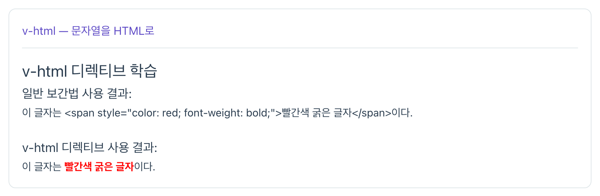
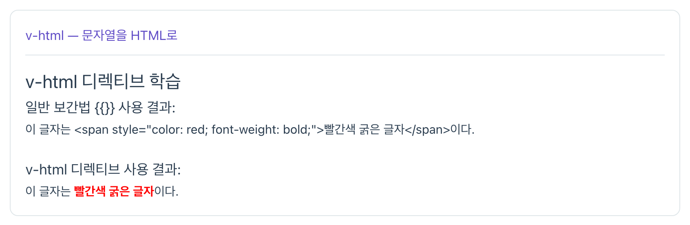
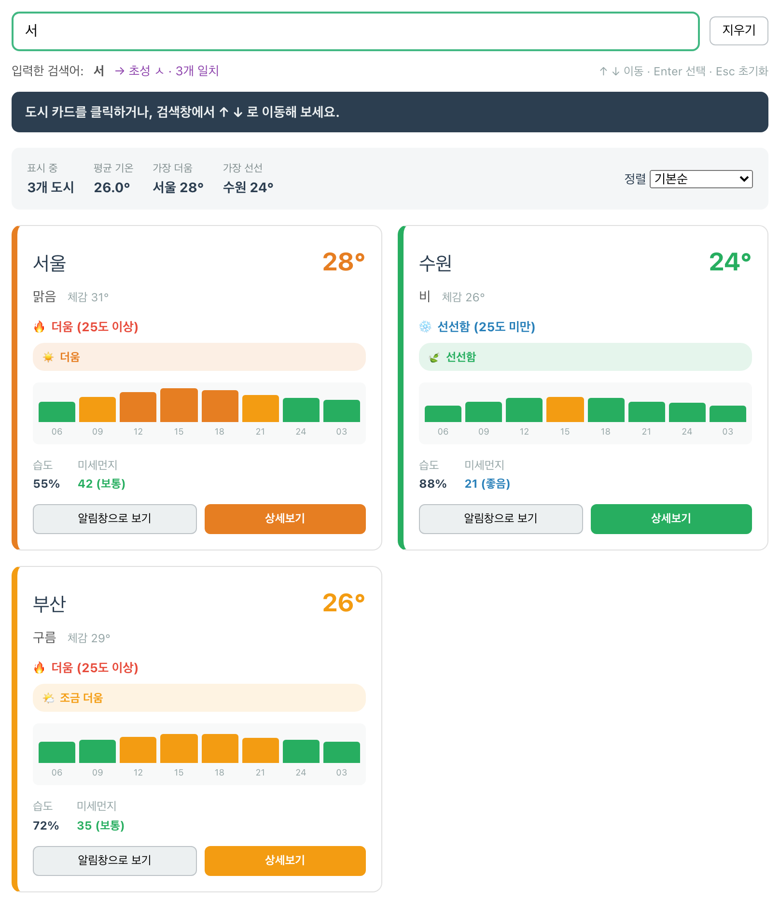
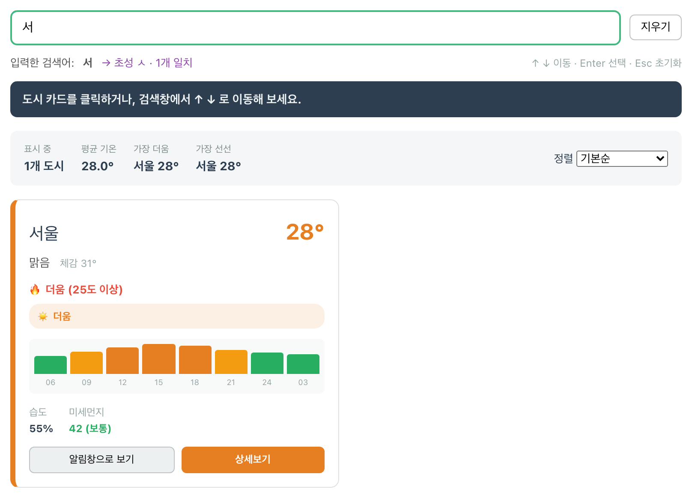
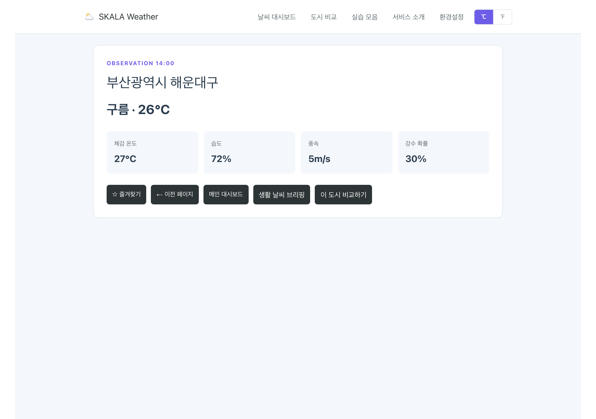
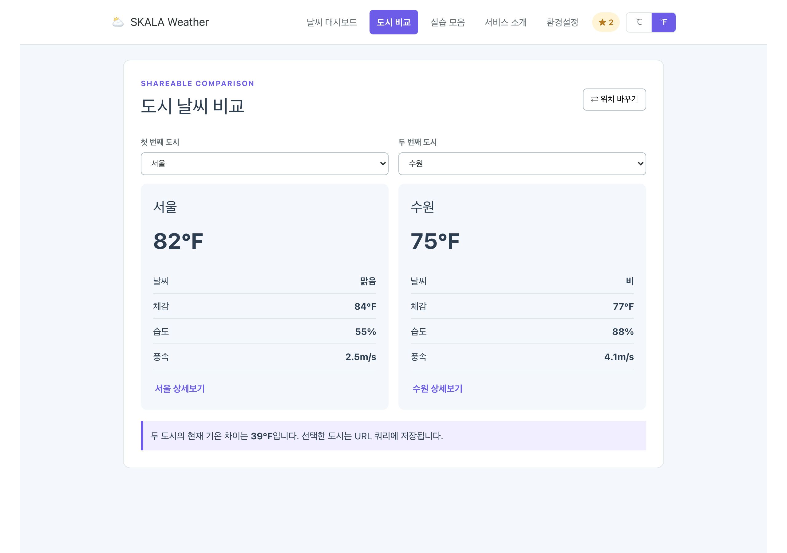

# skala-vue

SK AX **Full-Stack Engineering / Frontend-framework: Vue.js** 과정 실습 저장소입니다.
교재 실습 예제를 따라 작성하고, 각 단원마다 **개인 응용(Customization)** 을 덧붙여 정리합니다.

- 교육생: 허이준
- 원본 소스: [bottletiger/skala-vue](https://github.com/bottletiger/skala-vue)
- 배포 주소: _(추후 등록)_

---

## 실행 방법

```sh
npm install     # 의존성 설치
npm run dev     # 개발 서버 실행 (localhost:3000)
npm run build   # 프로덕션 빌드
npm run lint    # ESLint 검사
```

## 프로젝트 구조

```
src/
├─ App.vue                    # 레이아웃 뼈대 — TheHeader + RouterView 배치
├─ components/
│  ├─ TheHeader.vue           # 상단 네비게이션 (앱에 하나뿐인 컴포넌트)
│  ├─ UnitToggler.vue         # 온도 단위(℃/℉) 전환 — Navigation Bar 옆 배치
│  └─ practices/              # 교재 실습 컴포넌트 모음
│     ├─ basic/               # Dev Setup (p.69~71)
│     ├─ directive/           # Vue Directive (p.74~92)
│     ├─ event/               # Vue Event Handling (p.94~105)
│     ├─ form/                # Form Data Binding (p.106~112)
│     ├─ style/               # Vue Style (p.113~114)
│     ├─ composition/         # Composition API (p.117~144)
│     ├─ component/           # Vue Components (p.146~178)
│     ├─ library/             # Pinia (p.199~211)
│     └─ handson/             # Hands on — Weather Mockup(p.116) · Weather Composition(p.145)
│        └─ weather-component/ # Hands on — Weather Component(p.178)
├─ data/
│  ├─ weather.js              # 대시보드·상세·비교·브리핑 View가 공유하는 Mock Data
│  └─ practices.js            # 실습 컴포넌트 주제별 레지스트리 (동적 import)
├─ router/index.js            # 지연 로딩·동적 경로·Catch-all Route
├─ stores/
│  ├─ counter.js              # Code Challenge 스토어 (p.211)
│  ├─ configStore.js          # 온도 단위·대시보드 설정·변경 이력 (p.212)
│  ├─ favoriteStore.js        # 즐겨찾기 도시 — View 사이에서 공유
│  └─ plugins.js              # Pinia Plugin — localStorage 영속 + 액션 이력
├─ composables/
│  └─ useTemperature.js       # 온도 단위 변환 (p.212가 "범위 제외"로 남긴 부분)
├─ views/                     # WeatherHome·Detail·About·Compare·Briefing·Settings
│                             # PracticeIndex·PracticeTopic·NotFound
└─ assets/ · utils/
```

`App.vue`는 상단 메뉴(`TheHeader`)와 페이지 렌더링 영역(`RouterView`)을 배치하는 역할만 하고,
네비게이션 마크업과 스타일은 `TheHeader.vue`가 가집니다. 대시보드·도시 비교·실습 모음·
서비스 소개 화면을 새로고침 없이 전환합니다.

---

## 단원별 실습 기록

### 1. Vue Syntax — Dev Setup (p.69~71)

| 교재    | 실습 내용                                        | 파일                            |
| ------- | ------------------------------------------------ | ------------------------------- |
| p.69~70 | 반응형 데이터(Reactivity) — 일반 변수 vs `ref()` | `practices/basic/SampleOne.vue` |
| p.71    | Text Interpolation — 표현식 사용                 | `practices/basic/SampleTwo.vue` |

**Customization**

- `SampleTwo.vue` — 교재 코드의 사용하지 않는 `import { ref }` 구문을 제거했다.
  ESLint `no-unused-vars` 에 걸리는 코드라 실제로는 쓰지 않는 import를 남겨두지 않았다.

> 💭 **회고** — 첫날은 디렉티브가 그냥 'HTML 에 붙이는 속성' 으로만 보였다. 태그를 옮겨 적는 작업에 가까웠고, 왜 이게 프레임워크씩이나 되는지 실감이 안 났다.

### 2. Vue Syntax — Vue Directive (p.74~92)

| 교재 | 실습 내용                               | 파일                                     |
| ---- | --------------------------------------- | ---------------------------------------- |
| p.74 | `v-html` — 문자열을 HTML로 해석         | `practices/directive/VHtmlSample.vue`    |
| p.75 | `v-html` 의 XSS 취약점                  | `practices/directive/VHtmlXssSample.vue` |
| p.76 | `v-text` — `innerText` 와 동일 동작     | `practices/directive/VTextSample.vue`    |
| p.77 | `v-bind` 기본 — href / src / disabled   | `practices/directive/VBindBasic.vue`     |
| p.79 | `v-bind` 클래스 바인딩 (객체 · 배열)    | `practices/directive/VBindClass.vue`     |
| p.81 | `v-bind` 스타일 바인딩 (객체 · 배열)    | `practices/directive/VBindStyle.vue`     |
| p.83 | `v-bind` same-name shorthand (Vue 3.4+) | `practices/directive/VBindShorthand.vue` |
| p.84 | `v-if` / `v-else-if` / `v-else`         | `practices/directive/VIfSample.vue`      |
| p.85 | `v-show` — CSS `display:none` 으로 숨김 | `practices/directive/VShowSample.vue`    |
| p.88 | `v-for` — 배열 · 객체 · 배열 내 객체    | `practices/directive/VForSample.vue`     |
| p.89 | `v-pre` — 컴파일 건너뛰기               | `practices/directive/VPreSample.vue`     |
| p.90 | `v-cloak` — 렌더링 전 깜빡임 방지       | `practices/directive/VCloakSample.vue`   |
| p.91 | `v-once` — 최초 1회만 렌더링            | `practices/directive/VOnceSample.vue`    |
| p.92 | `v-memo` — 지정 변수가 바뀔 때만 갱신   | `practices/directive/VMemoSample.vue`    |

#### Customization ① `VHtmlXssSample.vue` — sanitize로 XSS 막기

교재는 `v-html` 이 XSS에 뚫린다는 것까지만 보여주고 **대책은 다루지 않는다.**
직접 정제 로직을 구현해 **같은 입력을 [정제 없이] vs [정제 후] 나란히 렌더링**하도록 만들었다.

- `DOMParser` 로 문자열을 화면에 붙지 않는 문서로 파싱한 뒤 위험 요소만 제거한다.
  파싱 단계에서는 코드가 실행되지 않으므로 안전하게 검사할 수 있다.
  1. 위험 태그(`script`, `iframe`, `object`, `embed`, `link`, `meta`, `base`, `form`) 제거
  2. 모든 태그의 이벤트 핸들러 속성(`on*`) 제거
  3. `href` / `src` 의 `javascript:` URL 차단
- **sanitize가 걷어낸 항목을 목록으로 출력**해서 무엇이 왜 막혔는지 보이도록 했다.
- 클릭 한 번으로 공격을 재현하는 **페이로드 프리셋 버튼** 3종을 넣었다.
  교재의 페이로드는 `window.location.href` 로 다른 사이트로 튕겨버려 결과 확인이 어렵기 때문에,
  화면에 흔적을 남기는 비파괴 페이로드로 바꿨다.

> 📌 알게 된 점 — `<script>` 태그는 정제하지 않아도 실행되지 않는다.
> `v-html` 은 내부적으로 `innerHTML` 을 쓰는데, 이렇게 삽입된 script 태그는 브라우저 명세상
> 실행되지 않는다. 공격자가 굳이 `onerror` 같은 **이벤트 속성**을 파고드는 이유가 이것이다.

#### Customization ② `VForSample.vue` — 검색·정렬·합계 + `:key` 함정

**응용 1) 검색 · 정렬 · 합계**
교재는 배열을 그대로 뿌리기만 하지만, 실무에서 `v-for` 는 거의 항상 _가공된_ 배열을 그린다.
원본 `products` 배열은 건드리지 않고 화면에 그릴 배열만 `computed` 로 새로 만들었다.

- 상품명 검색 / 이름·가격 정렬 / 품절 상품 숨기기 / 합계 표시
- 정렬에 `toSorted()` 를 사용했다. 교재 p.19에서 다룬 ES14 메서드로,
  `sort()` 와 달리 **원본 배열을 변형하지 않고** 정렬된 새 배열을 돌려준다.
- `computed` 는 교재 p.117(Composition API)에서 다루지만, 파생 데이터를 다루는 데 적합해 미리 사용했다.

**응용 2) `:key` 를 index로 주면 생기는 실제 버그**
교재는 _"고유한 `:key` 를 안 주면 에러 또는 성능 저하가 발생한다"_ 고 경고만 한다.
**데이터가 실제로 깨지는 장면**을 눈으로 확인할 수 있게 만들었다.

- `:key="index"` 목록과 `:key="member.id"` 목록을 나란히 두고, 각 행에 입력창을 배치
- 양쪽에 메모를 입력한 뒤 **맨 앞에 새 항목을 끼워 넣으면**
  → `:key="index"` 쪽은 **입력한 메모가 엉뚱한 사람에게 달라붙는다**
  → `:key="member.id"` 쪽은 정상 유지

> 📌 알게 된 점 — 맨 앞에 항목이 끼어들면 기존 요소들의 index가 한 칸씩 밀린다.
> Vue는 key를 기준으로 DOM을 재사용하므로 "0번 자리"에 있던 DOM(사용자가 입력한 값까지)을
> 새로 들어온 항목이 그대로 물려받는다. **배열의 순서가 바뀔 수 있다면 index를 key로 쓰면 안 된다.**


_▲ `v-for` 실습 — 검색·정렬·합계와 `:key="index"` 버그 시연을 한 화면에 배치했다_

#### 그 외 교재 코드 대비 수정

- `VHtmlSample.vue`, `VTextSample.vue` — 설명용 `<h3>` 에 `v-pre` 를 추가했다.
  교재 그대로 `<h3>일반 보간법 {{}} 결과:</h3>` 를 쓰면 **빈 보간식으로 컴파일돼 중괄호가
  화면에서 사라진다** (에러는 나지 않는다 — 트러블슈팅 1 참고).
- `VForSample.vue` — 교재 `import { ref } from 'vue’` 의 따옴표 오타(`’`)를 수정했다.

> 💭 **회고** — `v-html` 예제에서 XSS 를 보여주고 대책 없이 다음 장으로 넘어가는 게 계속 걸렸다. "위험하다" 까지만 배우고 끝내면 실제로는 못 쓰는 기능이라, 여기서 처음으로 교재를 그대로 따라가는 대신 **빠진 자리를 내가 메우는 방식**을 택했다. 이후 34건의 개인 응용이 전부 이 방식에서 나왔다.

### 3. Vue Syntax — Vue Event Handling (p.94~105)

| 교재      | 실습 내용                                    | 파일                                      |
| --------- | -------------------------------------------- | ----------------------------------------- |
| p.94~96   | `v-on(@)` — Inline Handler vs Method Handler | `practices/event/VOnHandler.vue`          |
| p.97~100  | 이벤트 객체(`$event`) 전달 2가지 패턴        | `practices/event/EventObjectSample.vue`   |
| p.101~102 | 이벤트 수식어 — `.prevent` / `.stop`         | `practices/event/EventModifierSample.vue` |

> ✅ **p.105 Code Challenge** (v-on Event Handler / Event Object / Event Modifier) 완료

#### Customization ③ `VOnHandler.vue` — 주요 이벤트 8종 직접 붙여보기

교재 p.94는 주요 이벤트를 **표로 8가지 나열**해 두고, 예제(p.96)에서는 `@click` 하나만 다룬다.
나머지 이벤트를 직접 연결해 **정확히 언제 발생하는지** 이벤트 로그 패널로 확인하도록 만들었다.

- `input` · `change` · `keyup` · `keydown` · `submit` · `mouseenter` · `mouseleave` 연결
- 발생한 이벤트를 종류별 색상 배지 + 시각과 함께 최근 8건까지 기록

> 📌 알게 된 점 — `input`은 **글자를 칠 때마다**, `change`는 **포커스가 빠질 때 한 번만** 발생한다.
> 로그로 보면 `keydown → input → keyup` 순서로 찍히고, Tab을 눌러 포커스가 빠지는 순간에야
> `change`가 한 번 찍힌다. 이 차이가 뒤에 배울 `v-model.lazy` 수식어(p.110)의 동작 원리다.

#### Customization ④ `EventObjectSample.vue` — 이벤트 객체 속성 실시간 관측기

교재 p.97은 이벤트 객체 속성을 **표로 12개** 정리해 두지만, 예제(p.100)에서 실제로 써 보는 건
`clientX` / `clientY` / `target.tagName` 3개뿐이다. 나머지가 어떻게 다른지 직접 관측한다.

1. **좌표 3종 비교** — `clientX/Y` vs `pageX/Y` vs `screenX/Y` 를 마우스 이동에 맞춰 실시간 표시
2. **`e.target` vs `e.currentTarget`** — 부모 DIV에 리스너를 걸고 자식을 클릭해 둘이 갈라지는 것을 확인
3. **`e.key` vs `e.code` + 조합키** — `shiftKey` / `ctrlKey` / `altKey` 를 배지로 표시

> 📌 알게 된 점 — 스크롤한 상태에서 마우스를 움직이면 `clientY`(480)와 `pageY`(1182)가 크게 벌어진다.
> 이 차이를 모르고 쓰면 스크롤된 페이지에서 툴팁 위치가 어긋나는 버그가 난다.
> 또 `Shift + a` 는 `key`가 `"A"`, `code`는 `"KeyA"` 다.
> **입력값이 필요하면 `key`, 단축키를 만들려면 `code`** 를 쓴다. `code`는 물리적 자판 위치라서
> 한글 모드에서도 값이 변하지 않기 때문이다.

#### Customization ⑤ `EventModifierSample.vue` — 교재가 빠뜨린 `.once` 와 `.self`

교재 p.101 표에는 수식어가 **4가지**(`.prevent` `.stop` `.once` `.self`) 정리돼 있는데,
p.102 예제 코드에는 **앞의 2개만** 있다. 빠진 2개를 직접 구현했다.

- **`.once`** — 설문 제출 버튼에 적용. 3번 눌러도 1번만 실행되는 것을 로그로 확인.
  한 번 소모되면 되살릴 방법이 없어서, "되살리기"는 `:key`를 바꿔 **버튼을 통째로 새로 그리는** 방식으로 구현했다.
- **`.self`** — 적용/미적용 박스를 나란히 두고, 자식 버튼을 눌렀을 때와 여백을 직접 눌렀을 때를 비교.
- 결과는 `alert` 대신 **화면 로그**로 남겼다. `alert`은 브라우저를 멈춰 세워서
  여러 이벤트가 어떤 순서로 발생하는지 관찰할 수 없기 때문이다.

> 📌 알게 된 점 — `.self`는 내부적으로 `e.target === e.currentTarget` 을 검사한다.
> 모달의 **바깥 배경을 눌렀을 때만 닫기**를 구현할 때 쓰는 수식어다. 없으면 모달 내용을 클릭해도 창이 닫혀 버린다.

> 💭 **회고** — 이벤트 수식어 표에는 4개가 있는데 예제에는 2개만 있었다. 나머지를 직접 붙여 보다가, **교재의 표와 예제 사이 간격이 곧 실습거리**라는 걸 알게 됐다. 표를 볼 때 예제와 대조하는 습관이 생겼다.

### 4. Vue Syntax — Form Data Binding & Vue Style (p.106~114)

| 교재      | 실습 내용                                                 | 파일                                    |
| --------- | --------------------------------------------------------- | --------------------------------------- |
| p.106     | `v-model` 양방향 바인딩 + 내부 원리(`:value` + `@input`)  | `practices/form/VModelBasic.vue`        |
| p.107~109 | HTML Form 요소 5종과 `v-model` 매핑 규칙                  | `practices/form/VModelFormElements.vue` |
| p.110~112 | `v-model` 수식어 — `.lazy` / `.number` / `.trim` / 체이닝 | `practices/form/VModelModifier.vue`     |
| p.113~114 | Scoped Style / External Style (`@import`)                 | `practices/style/VueStyleSample.vue`    |

> ✅ **p.115 Code Challenge** (Form Data Binding / v-model Modifiers / Vue Style) 완료

이번 단원의 개인 응용은 전부 **Vue 소스 코드(`@vue/runtime-dom`, `@vue/shared`)를 직접 열어
교재 설명과 대조하는** 방식으로 잡았다. 교재가 한 줄로 요약한 문장 뒤에 실제로는 조건 분기가
숨어 있고, 그 분기가 한글 입력·타입 검증에서 곧바로 버그로 드러나기 때문이다.

#### Customization ⑥ `VModelBasic.vue` — `v-model`은 정말 `:value` + `@input`인가

교재 p.106은 `v-model`을 **"`v-bind`와 `v-on:input`을 결합한 것"** 이라고 설명하고 끝난다.
영어를 치면 실제로 똑같지만, **한글**을 치면 두 방식의 결과가 갈라진다.

`@vue/runtime-dom`의 `vModelText`를 열어 보니 교재에 없는 한 줄이 있었다.

```js
addEventListener(el, lazy ? 'change' : 'input', (e) => {
  if (e.target.composing) return // ← 교재에 없는 IME 조합 가드
  el[assignKey](castValue(el.value, trim, castToNumber))
})
if (!lazy) {
  addEventListener(el, 'compositionstart', onCompositionStart) // composing = true
  addEventListener(el, 'compositionend', onCompositionEnd) // composing = false
}
```

입력창 하나에 `input` · `compositionstart` · `compositionend`를 전부 걸고,
**같은 타이핑**에 대해 두 방식이 어떻게 달라지는지 나란히 관측하도록 만들었다.

- 조합 중 여부를 배지로 실시간 표시하고, 두 값이 갈라지면 배경색으로 강조
- `input` 이벤트 발생 횟수 vs `v-model`이 무시한 횟수를 카운트
- 발생 이벤트를 종류별 색상 배지로 최근 12건까지 기록

> 📌 알게 된 점 — "한글" 두 글자를 치면 `input` 이벤트가 **8번** 발생하는데
> 그중 **6번**을 `v-model`이 무시한다. 한글은 자음·모음이 조합되는 동안에도 `input`이 계속
> 발생하는데, 이때 상태를 갱신하면 Vue가 입력창을 다시 그리면서 **조합 중인 글자가 깨지기** 때문이다.
> 반대로 **검색어 자동완성**처럼 조합 중인 글자까지 실시간으로 받아야 하는 기능은 `v-model`로
> 만들 수 없다. 교재 p.116 Hands-on 요구사항 3번이 굳이 `:value` + `@input`으로 한글 검색을
> 만들라고 지정한 이유가 이것이었다.

#### Customization ⑦ `VModelFormElements.vue` — p.107 표가 다루지 않는 4가지

교재 p.107 표는 Form 태그 5종의 **ref 초기값 타입**만 정리한다. 실무 폼에서 바로 부딪히는
아래 네 가지는 표에도 예제에도 없어서 직접 만들어 확인했다.

1. **`value` 속성을 빠뜨린 다중 체크박스** — 적용/미적용을 나란히 두고 실물 시연
2. **`true-value` / `false-value`** — 서버가 `'Y'`/`'N'`이나 `1`/`0`을 요구하는 경우
3. **`select multiple`(→ 배열) 과 `:value`로 객체 통째로 바인딩** — 표에 아예 없는 두 가지
4. **서버로 전송될 페이로드 JSON 실시간 미리보기** — 타입 어긋남을 이 단계에서 잡는다

> 📌 알게 된 점 — ①의 원인이 예상과 달랐다. `vModelCheckbox`는 값을 **넣을 때**와
> 체크 표시를 **되돌릴 때** 서로 다른 곳을 본다.
>
> ```js
> // ① change 핸들러 — 배열에 넣는 값
> const elementValue = getValue(el) // el.value → "on" (브라우저 기본값)
> // ② setChecked() — 체크 표시를 되돌릴 때 찾는 값
> checked = looseIndexOf(value, vnode.props.value) > -1 // value 속성이 없으면 undefined
> ```
>
> 배열에는 `"on"`을 넣어 놓고 `undefined`를 찾으니 항상 `-1`이라, **체크하는 순간 Vue가 표시를
> 도로 꺼 버린다.** 더 나쁜 건 두 번째 체크박스부터다 — 배열에 `"on"`이 이미 있어서 상태가 안 바뀌고,
> 상태가 안 바뀌니 리렌더도 안 일어나 **체크 표시만 켜진 채 남는다.** 실제로 사과→바나나→딸기
> 순으로 눌러 보면 화면은 `[off, ON, ON]`인데 데이터는 `["on"]` 하나다.
> 순수 HTML 폼에서는 `name`별로 전송돼 티도 안 나던 실수인데, `v-model` 배열에서는 곧바로 데이터 손실이 된다.

#### Customization ⑧ `VModelModifier.vue` — "Number 타입으로 자동 형변환"의 함정

교재 p.110 표는 `.number`를 **"Number 타입으로 자동 형변환"** 이라고 한 줄로 정리한다.
그런데 Vue가 실제로 쓰는 함수는 `Number()`가 아니라 **`parseFloat()` 기반**이었다.

```js
// @vue/shared
const looseToNumber = (val) => {
  const n = parseFloat(val)
  return isNaN(n) ? val : n // ← 실패하면 원본 문자열이 그대로 반환된다
}
```

- **A) 직접 입력 관측** — `typeof`를 색상 배지로 실시간 표시
- **B) 변환 결과 대조표** — 11가지 입력에 대해 `looseToNumber()` vs `Number()` 비교,
  두 결과가 어긋나는 줄을 자동으로 강조
- **C)** `<input type="number">`에는 `.number`가 필요 없다는 것을 실물로 확인
- **D)** `.trim`은 **양끝만** 지운다 — 공백을 `␣`로 시각화해 가운데 공백이 남는 것을 확인
- **E)** `.lazy`는 한글 조합 가드를 **끈다**

> 📌 알게 된 점 — 브라우저에서 직접 찍어 본 결과가 교재 설명과 어긋났다.
>
> | 입력      | `.number` 결과 | 타입       | `Number()`였다면 |
> | --------- | -------------- | ---------- | ---------------- |
> | `"12abc"` | `12`           | number     | `NaN`            |
> | `"abc"`   | `"abc"`        | **string** | `NaN`            |
> | `""`      | `""`           | **string** | `0`              |
> | `"0x10"`  | `0`            | number     | `16`             |
>
> `"12abc"`가 **에러 없이 `12`로 통과**하고, `"abc"`는 숫자가 아니라 **문자열 그대로** 남는다.
> 즉 `.number`를 썼다는 이유로 타입을 믿으면 안 되고, 서버로 보내기 전에 `typeof` 검사를 따로 해야 한다.
>
> 그리고 `vModelText` 안의 `const castToNumber = number || vnode.props.type === 'number'` 때문에
> **`type="number"`면 수식어 없이도 숫자 변환이 걸린다.** `type="number" v-model.number`는 중복이다.
> `.lazy`가 조합 가드를 등록하지 않는 것(`if (!lazy) { … }`)도 같은 파일에서 확인했다.
> `.lazy`가 쓰는 `change`는 어차피 한글 조합이 끝난 뒤에 발생하므로 가드가 필요 없기 때문이다.


_▲ `.number` 변환 대조표 — `looseToNumber()` 와 `Number()` 의 결과가 어긋나는 줄이 자동 강조된다_

#### Customization ⑨ `VueStyleSample.vue` — scoped를 "설명" 말고 "증거"로

교재 p.113은 scoped를 **"다른 컴포넌트에는 영향을 주지 않는다"** 고 문장으로만 설명하고,
p.114 예제는 컴포넌트가 하나뿐이라 정작 **그 격리가 일어나는 장면이 없다.**
또 Vue 3의 핵심 스타일 기능인 `:deep()`과 CSS `v-bind()`는 교재에 통째로 빠져 있다.

1. **격리의 실물** — `StyleChildCard.vue`를 만들어 부모와 **똑같은 `.title` 클래스**를 쓰게 하고,
   두 컴포넌트가 서로 다른 색으로 남는 것을 나란히 배치
2. **`data-v-` 해시 관측** — 템플릿 ref로 DOM 속성을 마운트 직후 직접 읽어 화면에 표시
3. **`:deep()`** — 체크박스로 on/off 하며 자식 내부까지 스타일이 도달하는 순간을 비교
4. **CSS `v-bind()`** — 컬러피커·슬라이더로 카드의 색·모서리·여백을 실시간 제어

> 📌 알게 된 점 — `scoped`는 런타임 격리가 아니라 **컴파일 타임 치환**이다.
> 빌드 후 CSS를 열어 보니 `.live-card` 규칙이
> `.live-card[data-v-95a57b12]{background-color:var(--e2130de8); …}` 로 바뀌어 있었다.
> 해시가 컴포넌트마다 달라서 같은 클래스명이어도 서로 안 걸리는 것이고,
> 자식 엘리먼트에는 부모의 해시가 안 붙기 때문에 `.card-body { … }`라고 써도 **아무 일도 일어나지 않는다.**
> `:deep(.card-body)`를 써야 선택자가 `[data-v-부모] .card-body`로 바뀌어 자식 안까지 닿는다.
> UI 라이브러리(p.231 단원) 내부 마크업을 커스터마이징할 때 반드시 쓰게 될 문법이다.
>
> CSS `v-bind()`는 **해시가 붙은 CSS 변수**로 컴파일된다. 개발 모드에서는
> `--263c18ce-themeColor`처럼 이름이 남지만 `npm run build` 후에는 `--e2130de8`로 완전히 해시된다.
> 인라인 `:style`과 달리 **`:hover`나 미디어 쿼리 안에서도 쓸 수 있다.**
> 단, 숫자만 넘기면 CSS가 해석하지 못하므로 `computed`로 `"8px"`처럼 **단위를 붙여** 넘겨야 한다.

#### 그 외 교재 코드 대비 보완

- 교재 p.114가 `@import '@/assets/challenge.css'`로 불러오는 파일이 교재에 없어서 **직접 작성**했다.
  이 블록은 `scoped`가 없어 `.btn-external`이 **프로젝트 전역**에 퍼진다는 점을 주석으로 남겼다.
  `npm run build`로 확인해 보니 실제로 `data-v-` 없이 전역 규칙으로 번들에 들어간다.

> 💭 **회고** — `v-model` 이 ":value + @input 의 단축" 이라는 한 줄을 의심해 본 게 이 단원의 전부다. 한글을 치는 순간 이벤트가 8번 터지고 두 방식이 갈라지는 걸 보고 나서야, **문서의 요약과 실제 구현은 다르다**는 걸 체감했다. `node_modules` 안의 Vue 소스를 처음 열어 본 것도 여기서였고, 이게 가장 크게 남았다.

### 5. Hands on — Weather Mockup (p.116)

| 교재  | 실습 내용                                    | 파일                                  |
| ----- | -------------------------------------------- | ------------------------------------- |
| p.116 | 날씨 목업 종합 과제 (요구사항 1~5 전부 충족) | `practices/handson/WeatherMockup.vue` |

> 🖥️ **화면은 제출용 결과물이라 교재·요구사항 언급을 넣지 않았다.**
> 대신 하단에 **✅ 기본 기능 체크리스트**(6항목)와 **✨ 추가 기능**(8항목)을 두어,
> 기능명을 굵게 표시해 어디까지가 기본이고 어디부터가 직접 얹은 부분인지 한눈에 보이게 했다.
> 아래 교재 대조는 **학습 기록용**이라 README에만 남긴다.

p.117부터 Composition API로 넘어가므로, **p.116은 p.69~114 문법 전체를 한 화면에 모으는 종합 과제**다.
요구사항 5가지가 앞 단원의 개인 응용과 거의 1:1로 이어져서, "앞에서 만든 걸 실전에서 써먹는 완결편"으로 잡았다.

| 요구사항 | 내용                                                  | 구현                                                      |
| -------- | ----------------------------------------------------- | --------------------------------------------------------- |
| 1        | 배열 렌더링 `v-for` + `:key="id"`                     | 도시 카드 그리드                                          |
| 2        | 조건부 렌더링 `v-if` (25도 기준)                      | 교재 2단계 라벨 유지 + 개인 응용 ⑫ 구간 칩 병기           |
| 3        | 한글 처리 `:value` + `@input`                         | 검색창 (개인 응용 ⑩⑪이 여기에 통합)                       |
| 4        | 카드 클릭 → 상태바 / [상세보기] `@click.stop` → alert | 교재 그대로 + 개인 응용 ⑭ 모달 병기                       |
| 5        | 본인 데이터 추가                                      | 도시 5개 + 습도·미세먼지·체감온도·시간대별 예보 필드 추가 |


_▲ 날씨 대시보드 — 초성 `ㅅㅇ` 만 입력해도 서울·수원이 걸린다_

#### Customization ⑩ 한글 초성 검색 — `:value` + `@input` 이어야만 하는 이유

요구사항 3은 **"입력한 도시명을 출력한다"** 까지만 요구해서 사실상 껍데기다.
실제 필터링에 더해 **초성 검색**(`ㅅㅇ` → 서울)까지 구현했다.

완성형 한글은 `0xAC00`부터 (초성 19 × 중성 21 × 종성 28) 순서로 배열돼 있다.

```js
초성 index = (code - 0xAC00) / 588   // 588 = 21 × 28
종성 index = (code - 0xAC00) % 28    // 0 이면 받침 없음
```

이 두 줄로 **초성 추출과 조사 판별이 모두 해결된다.**
교재 문구 `"{도시}이 선택되었습니다."` 는 조사가 `이`로 고정이라 받침 없는 도시는
"제주**이** 선택되었습니다"가 되므로, `% 28` 로 받침을 판별해 **조사를 자동 처리**했다.

> 📌 알게 된 점 — **초성 검색은 `v-model`로는 원리상 불가능하다.**
> `ㅅ`은 아직 조합이 끝나지 않은 글자라, p.106 개인 응용 ⑥에서 확인한
> `if (e.target.composing) return` 가드가 그대로 삼켜 버리기 때문이다.
> **요구사항 3이 굳이 `:value` + `@input`을 지정한 이유가 이것이었다.**
>
> 처음엔 `이름.includes(검색어) || 이름초성.includes(검색어초성)` 으로 짰는데
> `"서"`가 수원·부산까지 잡는 오탐이 났다. `"서"`의 초성 `ㅅ`이 `"수원"(ㅅㅇ)`,
> `"부산"(ㅂㅅ)` 에 들어 있기 때문이다. **완성된 글자는 초성으로 비교하면 안 된다.**
> 그래서 글자 단위로 미끄러뜨리며 **낱자음이면 초성과, 완성 글자면 글자끼리** 비교하도록 고쳤다.
> 덤으로 `"강ㄹ"` 처럼 **조합 도중에 실제로 나오는 형태**도 강릉에 매칭된다.

#### Customization ⑪ 키보드 네비게이션 — 교재 p.103~104 표를 실전으로

교재 **p.103~104에 키보드·시스템·마우스 수식어가 표로 정리돼 있는데 예제 코드가 하나도 없다.**
(p.102 예제는 `.prevent` / `.stop` 뿐이라 `EventModifierSample`도 거기까지만 다뤘다.)

게다가 p.103 표는 `.up` / `.down` 의 활용 예시를
**"자동완성 검색어 목록에서 화살표로 리스트 이동할 때"** 라고 적어 두었는데,
이 도시 검색이 정확히 그 상황이라 그대로 구현했다.

- `@keydown.down.prevent` / `@keydown.up.prevent` — 카드 하이라이트 순환 이동
- `@keydown.enter` — 현재 하이라이트된 도시 선택
- `@keydown.esc` — 검색 초기화

> 📌 알게 된 점 — `.prevent`를 같이 붙여야 한다. 안 붙이면 방향키의 기본 동작(입력 커서를
> 문자열 끝/처음으로 보내기)이 같이 일어나서 검색어 편집이 방해된다. **수식어는 체이닝된다**는
> p.110의 내용이 이벤트 수식어에서도 그대로 통한다.

#### Customization ⑫ 온도 구간을 데이터로 — 조건문 체인 걷어내기

요구사항 2는 25도 기준 2단계이고 "조건은 다르게 해도 된다"고 허용한다.
그런데 **`v-else-if` 다단계 자체는 이미 `VIfSample`(p.79)에 있으므로 단계만 늘리는 건 응용이 아니다.**
조건문 체인을 걷어내고 **구간 테이블 + `find()`** 로 바꿔 데이터 주도로 만들었다.
기준값은 기상청 폭염·한파 특보 기준(35 / 33 / -12도)을 따랐다.

```js
const TEMP_BANDS = [ { min: 35, label: '폭염경보', color: '#c0392b' }, … ]
const bandOf = (temp) => TEMP_BANDS.find((band) => temp >= band.min)
```

구간을 추가·수정할 때 **템플릿을 건드릴 필요가 없다.** 미세먼지 등급도 같은 방식으로 처리했다.

#### Customization ⑬ 정렬 · 집계 · 중첩 `v-for`

- `computed`로 평균 기온 / 최고 / 최저를 집계하고, `toSorted()`로 4가지 정렬을 붙였다
- 시간대별 예보는 **배열 안의 배열**이라 **중첩 `v-for`** 로 렌더한다 (교재에 없는 형태).
  CSS만으로 미니 막대 그래프를 그렸고, 막대마다 ⑫의 구간 색을 적용했다
- 중첩 `v-for`의 `:key`는 `index` 대신 시각 문자열을 썼다 — `:key="index"`의 문제는 Customization ②에서 이미 확인했다

#### Customization ⑭ `window.alert` 대신 커스텀 모달

요구사항 4가 `window.alert`을 명시하므로 **교재 버튼은 그대로 두고** 모달 버전을 나란히 뒀다.

- 배경(Dim) 클릭으로 닫기 → **`@click.self`** (p.101 표가 적어둔 활용 예시 그대로)
- Esc로 닫기 → **`@keydown.esc`** (p.103 표, 교재에 예제 없음)

> 📌 알게 된 점 — `@keydown.esc`가 동작하려면 **그 엘리먼트에 포커스가 있어야 한다.**
> 모달을 열 때 `tabindex="-1"` 을 준 배경에 `nextTick(() => el.focus())` 로 포커스를 옮겨야 했다.
> 그리고 `alert`은 **브라우저를 통째로 멈춰 세워서** 스타일을 줄 수도, 자동화로 검증을 이어갈 수도 없다.
> (그래서 이 과제를 브라우저로 검증할 때 alert 버튼만은 클릭하지 않았다)

#### 그 외 — CSS 변수 주입 경로와 스캐폴드 레이아웃

- **`v-bind()`를 카드 색에 쓰려다 막혔다.** p.113 개인 응용 ⑨에서 배운 CSS `v-bind()`는
  **컴포넌트 인스턴스 단위**로 CSS 변수를 만들기 때문에, `v-for`로 찍어낸 카드마다 다른 색을 줄 수 없다.
  그래서 `:style="{ '--band': … }"` 로 **엘리먼트마다 CSS 변수를 직접 주입**하고 CSS에서 `var(--band)`로 받았다.
  같은 CSS 변수라도 주입 경로가 다르다.
- **`main.css`의 스캐폴드 기본 레이아웃을 제거했다.** Vue 스캐폴드는 `@media (min-width: 1024px)`에서
  `#app`을 2단 그리드(`1fr 1fr`)로 만드는데, 초기 Welcome 페이지 전용 설정이라
  **실습 컴포넌트가 전부 화면 절반에 갇혀 있었다.** 카드 그리드가 1열로 눌려서 걷어냈다.

---

> 💭 **회고** — 가장 오래 붙잡은 과제였다. 요구사항 5개는 금방 끝났는데 "본인만의 기능을 추가하라" 는 줄에서 막혔다. 결국 **이미 만든 기능이 불편한 지점**(alert 이 화면을 멈춰 세운다, 조건문 체인이 길다)에서 아이디어를 찾았다. 없는 걸 새로 상상하는 것보다 이 방법이 훨씬 잘 나왔다.

### 6. Composition API (p.117~145)

Code Challenge **p.126 (Reactive State)** · **p.144 (Computed & Watchers)** 는 교재 예제 원본으로
간결하게 작성하고, **개인 응용은 단원 마지막 Hands on (p.145) 한 곳에 몰아넣었다.**
교재 p.145 요구사항 5 자체가 "본인만의 반응형 상태 변수, Computed, Watcher를 추가한다" 이기 때문이다.

| 교재      | 실습 내용                             | 파일                                          |
| --------- | ------------------------------------- | --------------------------------------------- |
| p.122     | `ref()` — 원시값 · 배열 · 객체 반응형 | `practices/composition/RefBasic.vue`          |
| p.124     | `reactive()` — 객체 · 배열 반응형     | `practices/composition/ReactiveBasic.vue`     |
| p.128     | `computed()` — 캐싱 vs 일반 함수      | `practices/composition/ComputedBasic.vue`     |
| p.131     | `watch()` — 이전/현재 값 콜백         | `practices/composition/WatchBasic.vue`        |
| p.133     | `watch()` Multi-Source — 배열로 묶기  | `practices/composition/WatchMultiSource.vue`  |
| p.135~136 | `watch()` Deep — `{ deep: true }`     | `practices/composition/WatchDeep.vue`         |
| p.138~139 | `watch()` + `reactive()` 감시 규칙    | `practices/composition/WatchReactive.vue`     |
| p.142     | `watchEffect()` — 자동 의존성 추적    | `practices/composition/WatchEffectSample.vue` |
| **p.145** | **Hands on — Weather Composition**    | `practices/handson/WeatherComposition.vue`    |

**교재 요구사항 1~4 충족 (p.145)**

| 요구사항 | 구현                                                                  |
| -------- | --------------------------------------------------------------------- |
| 1        | `searchQuery` · `selectedCityInfo` · `weatherList` 를 `ref()` 로 선언 |
| 2        | `filteredWeatherList` — 도시 이름에 검색어가 포함된 항목만 `computed` |
| 3        | `watch(selectedCityInfo, …)` 콘솔 로그 + `watchEffect` 로 검색어 추적 |
| 4        | 검색어 없음 / 결과 있음 / 결과 없음 3분기 렌더                        |

#### Customization ⑮ 디바운스 조회 — `onCleanup` 으로 이전 요청 취소

`watchEffect` 콜백의 첫 인자 `onCleanup` 은 **다음 실행 직전**에 호출된다.
여기서 아직 날아가지 않은 요청을 취소하지 않으면
**늦게 도착한 옛날 응답이 최신 결과를 덮어쓰는** 사고가 난다.

```js
watchEffect((onCleanup) => {
  const timer = setTimeout(() => {
    /* 조회 */
  }, 400)
  onCleanup(() => clearTimeout(timer)) // ← 실제 API 라면 AbortController.abort()
})
```

"서울" 을 두 글자로 치면 **요청 2 · 취소 1 · 완료 1** 이 화면 우측에 그대로 집계된다.
교재 p.141 은 watchEffect 를 "자동 추적" 편의 기능으로만 소개하고 뒷정리는 다루지 않는다.

#### Customization ⑯ 쓰기 가능한 `computed` — 섭씨 ↔ 화씨

교재 p.127 은 "computed 로 만든 속성은 **기본적으로** 읽기 전용" 에서 끝난다.
콜백 대신 `{ get, set }` 을 넘기면 **`v-model` 을 걸 수 있는 computed** 가 된다.
내부 상태는 `isFahrenheit` boolean 하나로 두고, 화면에는 '섭씨'/'화씨' 라는 말로 오간다.

```js
const unitLabel = computed({
  get: () => (isFahrenheit.value ? '화씨' : '섭씨'),
  set: (label) => {
    isFahrenheit.value = label === '화씨'
  },
})
```

#### Customization ⑰ 조건 묶음 감시 — 같은 tick 이면 조회는 한 번

여러 소스를 배열로 묶는 진짜 이유는 코드가 짧아져서가 아니라 **콜백이 도는 횟수** 때문이다.
감시자를 따로 두면 두 값이 같은 순간에 바뀔 때 콜백이 두 번 돌아 **API 도 두 번** 나간다.

- `watch(sortKey)` + `watch(statusFilter)` → 동시 변경 시 **2회**
- `watch([sortKey, statusFilter])` → 동시 변경 시 **1회**

"정렬 + 날씨 동시 변경" 버튼을 누르면 두 숫자가 갈라지는 것이 화면에 그대로 보인다.
필터 초기화처럼 값 여러 개를 한꺼번에 되돌리는 동작에서 중복 요청이 생기느냐가 여기서 갈린다.

#### Customization ⑱ 즐겨찾기 변경 이력 — `deep` 감시 + 스냅샷

교재 p.134 는 "deep 을 쓰면 `newValue` 와 `oldValue` 가 똑같이 나와 과거를 추적할 수 없다" 에서 멈춘다.
과거가 필요하면 **감시자 밖에 스냅샷을 따로 들고 있으면 된다.**

```js
let snapshot = structuredClone(toRaw(favorites.value))
watch(
  favorites,
  (newVal) => {
    /* snapshot 과 대조해 "무엇이 어떻게" 바뀌었는지 뽑는다 */
    snapshot = structuredClone(toRaw(newVal))
  },
  { deep: true },
)
```

★ 를 누를 때마다 "대구 즐겨찾기 추가" 처럼 **변경 이력**이 쌓인다.
되돌리기(Undo), "저장하지 않고 나가시겠습니까?" 경고가 전부 이 구조다.

#### Customization ⑲ `computed` 3단 체인 + 재계산 계기판

`검색 필터 → 날씨 필터 → 정렬 → 통계` 로 단계를 나누면
앞 단계 결과가 그대로일 때 **뒷 단계는 다시 계산되지 않는다.**
그 캐싱을 눈으로 볼 수 있게 각 단계의 실행 횟수를 화면 하단 계기판에 띄웠다.

> ⚠️ 이때 카운터를 `ref` 로 잡으면 **무한 루프**가 된다.
> computed 게터 안에서 반응형 값을 바꾸면 → 화면이 다시 그려지고 → 게터가 또 돈다.
> 그래서 카운터는 일반 변수로 두고, 템플릿에서 함수로 읽는다
> (일반 함수가 매 렌더 재실행된다는 p.128 의 성질을 거꾸로 이용한 것이다).

---

> 💭 **회고** — `watch` 와 `computed` 중 뭘 써야 할지가 계속 헷갈렸다. "값을 만들면 computed, 일을 시키면 watch" 로 정리한 뒤에야 손이 멈추지 않았다. 재계산 횟수를 화면에 띄워 캐싱을 눈으로 확인한 것도 도움이 됐다 — **콘솔 로그로 확인하는 것과 화면에 숫자로 띄우는 것은 이해의 깊이가 달랐다.**

### 7. Vue Components — Lifecycle (p.146~155)

> ✅ **p.155 Code Challenge** (Component Lifecycle Hook Example) 완료

| 교재      | 실습 내용                                                     | 파일                                      |
| --------- | ------------------------------------------------------------- | ----------------------------------------- |
| p.154~155 | `setup` → `onMounted` → `onUpdated` → `onUnmounted` 흐름 확인 | `practices/component/LifecycleChild.vue`  |
| p.155     | `v-if`로 자식 컴포넌트를 생성·소멸시키는 부모                 | `practices/component/LifecycleParent.vue` |

- `LifecycleParent`에서 `v-if`를 전환해 자식 컴포넌트를 파괴하고 다시 생성한다.
- `LifecycleChild`는 마운트 후 3초 간격 타이머를 시작하고, 값이 바뀔 때마다 업데이트 훅을 확인한다.
- 언마운트될 때 `clearInterval()`로 타이머를 정리해 컴포넌트 소멸 후에도 작업이 남는 메모리 누수를 막는다.
- 교재 원본 흐름은 그대로 유지하고, 아래 개인 응용을 부모 컴포넌트 하단에 추가했다.

#### Customization ⑳ 부모와 자식의 상태 수명 비교

교재 예제는 Lifecycle Hook 실행 순서를 콘솔로 확인하지만, 컴포넌트가 소멸할 때
**어떤 상태가 사라지고 어떤 상태가 남는지**는 화면에서 비교하기 어렵다.

- 부모에 별도 카운트를 두어 자식을 파괴하고 다시 생성해도 값이 유지되는 것을 확인한다.
- 자식의 로컬 카운트는 컴포넌트를 다시 생성하면 0부터 시작한다.
- 자식 제거 횟수를 부모 상태로 누적해 부모와 자식의 상태 수명 차이를 한 화면에서 관찰한다.

---

> 💭 **회고** — Hook 순서를 콘솔로만 보라는 게 아쉬워서 부모와 자식의 상태 수명을 나란히 띄웠다. **"언제 호출되는가" 보다 "그때 무엇이 사라지는가" 가 훨씬 이해에 도움이 됐다.**

### 8. Vue Components — Props & Emits (p.156~172)

> ✅ **p.172 Code Challenge** (Props & Emits Example) 완료

| 교재      | 실습 내용                                       | 파일                                       |
| --------- | ----------------------------------------------- | ------------------------------------------ |
| p.168~172 | 부모 상태를 Props로 자식에게 전달               | `practices/component/PropsEmitsParent.vue` |
| p.168~172 | Emit 이벤트와 Payload로 부모에게 상태 변경 요청 | `practices/component/PropsEmitsChild.vue`  |

- 부모는 `:parent-data="message"`로 반응형 상태를 자식에게 내려보낸다.
- 자식은 `defineProps()`로 전달받을 값의 타입과 필수 여부를 선언하며, Props를 직접 수정하지 않는다.
- 자식이 `emit('update-request', payload)`를 실행하면 부모의 `@update-request` 핸들러가 Payload를 받아 상태를 변경한다.
- 교재의 고정 Payload 버튼은 그대로 유지하고, 아래 개인 응용을 자식 컴포넌트 하단에 추가했다.

#### Customization ㉑ 직접 입력한 동적 Payload 전달

교재 예제는 항상 같은 문자열만 Emit하므로 Payload가 실제 사용자 입력에 따라 달라지는 흐름이 보이지 않는다.

- 자식 입력창의 값을 `v-model`로 관리하고 폼 제출 시 `emit()`의 Payload로 전달한다.
- `.trim()`과 빈 값 검사를 적용하고, 최대 40자 제한과 글자 수 표시를 추가했다.
- 부모는 같은 이벤트 핸들러로 고정·동적 Payload를 모두 처리하고 갱신 횟수를 누적한다.

---

> 💭 **회고** — Props 로 내리고 Emits 로 올린다는 규칙 자체는 단순한데, 막상 화면을 쪼개려니 **어디까지를 한 컴포넌트로 볼지**가 어려웠다. 이 감각은 아직 부족하다고 느낀다.

### 9. Vue Components — Component Slot (p.173~177)

> ✅ **p.177 Code Challenge** (Default / Named / Scoped Slot Example) 완료

| 교재      | 실습 내용                                     | 파일                                             |
| --------- | --------------------------------------------- | ------------------------------------------------ |
| p.174·177 | Default Slot과 Fallback 콘텐츠                | `SlotDefaultParent.vue` · `SlotDefaultChild.vue` |
| p.175·177 | `#header` Named Slot과 Default Slot 동시 사용 | `SlotNamedParent.vue` · `SlotNamedChild.vue`     |
| p.176·177 | Slot Props를 부모의 `v-slot`으로 수신         | `SlotScopedParent.vue` · `SlotScopedChild.vue`   |

이번 Code Challenge는 교재 기본 예제만 간결하게 구현하고 개인 응용은 바로 다음 Hands-on에 집중했다.

---

> 💭 **회고** — Slot 은 배울 때 가장 추상적이었는데, 카드 컴포넌트 하나를 만들어 보니 바로 납득이 됐다. `$slots` 로 넘어온 게 있을 때만 그리는 처리를 넣고 나서 "레이아웃을 계약으로 넘긴다" 는 말이 이해됐다.

### 10. Hands on — Weather Component (p.178)

날씨 화면의 상태와 기능은 유지하면서 역할별 컴포넌트로 분리했다.

| 요구사항 | 구현                                                                      |
| -------- | ------------------------------------------------------------------------- |
| 1        | `WeatherParent`가 검색어·도시 목록·선택 상태·즐겨찾기 등 반응형 상태 소유 |
| 2        | `BaseDashboardCard`가 검색·목록 박스의 공통 레이아웃과 Slot 제공          |
| 3        | `SearchBar`가 검색어 Props 수신 후 `update-query` Emit                    |
| 4        | `WeatherCard`가 도시 객체 Props 수신 후 `select-card`·`click-detail` Emit |
| 5        | 각 컴포넌트의 디자인을 `<style scoped>`로 분리                            |
| 6        | Slot 콘텐츠인 검색창·날씨 카드가 `WeatherParent`와 직접 통신              |
| 7        | `WeatherSummary`와 `WeatherDetailModal` 추가 컴포넌트 구현                |

#### Customization ㉒ Named Slot으로 레이아웃 계약 확장

교재의 `BaseDashboardCard`는 Default Slot 하나만 제공한다. 이를 `header`·Default·`footer` 세 영역으로
나눠 검색박스와 목록박스가 같은 틀을 쓰면서도 제목과 상태 표시 위치를 각자 주입하도록 확장했다.

- Slot이 들어오지 않은 `header`·`footer`는 `$slots`로 감지해 빈 영역을 만들지 않는다.
- p.177에서 따로 연습한 Named Slot을 실제 재사용 레이아웃에 바로 적용했다.

#### Customization ㉓ 즐겨찾기 Props/Emits 왕복 + 요약 컴포넌트

컴포넌트 분리 후에도 상태 원본은 부모 한 곳에 두는 원칙을 확인하기 위해 즐겨찾기 기능을 추가했다.

- 부모가 `favoriteIds`를 관리하고 `is-favorite` Props로 각 카드에 상태를 내려보낸다.
- 카드는 `toggle-favorite` 이벤트만 올리고 배열을 직접 수정하지 않는다.
- 별도 `WeatherSummary`가 검색 결과 수·평균 기온·최고 기온 지역·즐겨찾기 수를 표시한다.

#### Customization ㉔ 초성 검색·키보드 탐색을 컴포넌트 구조로 이식

기존 `WeatherMockup`에서 검증한 한글 초성 검색과 방향키 탐색을 단순 복사하지 않고 역할별로 나눴다.

- `SearchBar`는 `:value`·`@input`으로 IME 조합 중인 낱자음까지 부모에게 전달한다.
- `WeatherParent`는 완성형 한글의 초성 코드 분해와 검색 결과·활성 인덱스를 관리한다.
- `SearchBar`가 방향키·Enter·Esc 이벤트를 Emit하면 부모가 상태를 바꾸고, `WeatherCard`는
  `is-highlighted`·`is-selected` Props로 결과만 표현한다.

#### Customization ㉕ 상세 모달을 독립 컴포넌트로 분리

교재의 `alert` 동작은 **빠른 알림** 버튼으로 유지하면서 상세 화면은 `WeatherDetailModal`로 분리했다.

- 카드가 `open-modal` 이벤트로 도시 객체를 올리고 부모가 현재 상세 도시를 소유한다.
- 모달은 `city` Props를 받아 렌더링하고 `close` 이벤트만 부모에게 전달한다.
- 마운트 시 `useTemplateRef()`로 포커스를 옮겨 Esc 닫기를 보장하고, `@click.self`로 배경을
  클릭했을 때만 닫히게 했다.

---

> 💭 **회고** — 기능을 늘리는 것보다 **이미 만든 걸 컴포넌트 구조로 옮기는 게 더 어려웠다.** 초성 검색·키보드 탐색을 SearchBar 로 떼어내면서 상태를 어디에 둘지 몇 번을 고쳤다. 동작은 그대로인데 코드만 바꾸는 작업이라 진도가 안 나가는 느낌이었지만, 이후 화면을 추가할 때 그 값을 했다.

### 11. Hands on — Weather Router (p.196~197)

`App.vue`를 단일 실습 컴포넌트 진입점에서 라우터 레이아웃으로 전환했다.

| 요구사항                                | 구현                                                                                         |
| --------------------------------------- | -------------------------------------------------------------------------------------------- |
| 1. Router 지연 로딩 + Catch-all         | Home 외 View를 Dynamic Import하고 `/:pathMatch(.*)*`를 마지막에 배치                         |
| 2. `App.vue` Navigation Bar + 메인 영역 | 상단 메뉴를 `TheHeader` 컴포넌트로 분리하고 `App.vue`에 `TheHeader` + `RouterView` 배치      |
| 3. `WeatherHomeView`                    | `WeatherParent`의 검색·카드·요약 구조를 View로 전환하고 `router.push('/weather/' + id)` 처리 |
| 4. `WeatherDetailView`                  | `route.params.cityId`로 Mount 시점에 Mock Data 도시를 선택하고 기온·체감·습도·풍속 표시      |
| 5. `WeatherAboutView`                   | 서비스·Router 구조 소개와 `router.push()` 메인 복귀 버튼                                     |
| 6. 추가 View + Routing                  | `/compare` 경로의 `WeatherCompareView` 추가                                                  |


_▲ `/` 날씨 대시보드 — 검색·즐겨찾기·정렬·집계_


_▲ `/weather/city_01` 도시 상세 — 동적 라우트 파라미터_


_▲ `/practice` 실습 아카이브 — 1~3일차 실습 41개의 진입점_


_▲ `/kk` 처럼 매핑되지 않은 주소 — Catch-all Route 가 받는다_

#### Customization ㉖ 공유 가능한 두 도시 비교 View

추가 View를 정적 안내 화면으로 두지 않고, 두 도시의 기온·체감온도·습도·풍속을 한 화면에서
비교하는 기능으로 만들었다.

- 두 `<select>`의 선택값을 `left` / `right` Query String으로 보관한다.
- 선택이 바뀔 때 `router.replace()`를 써서 주소는 유지하되 히스토리를 불필요하게 쌓지 않는다.
- 예: `/compare?left=city_01&right=city_04`를 공유하면 서울·제주 비교 상태가 그대로 복원된다.
- 비교 중인 각 도시의 동적 상세 경로로 즉시 이동할 수 있고, 두 도시 위치를 바꾸는 기능도 추가했다.

> 📌 알게 된 점 — 검색어나 필터처럼 자주 바뀌는 상태를 `push()`로 동기화하면 글자 하나마다
> 뒤로 가기 이력이 쌓인다. 이런 상태는 `replace()`로 현재 이력만 바꾸고, 상세 페이지처럼 사용자가
> 독립된 화면 전환을 의도한 경우에는 `push()`를 쓰는 것이 맞다.


_▲ `/compare?left=city_01&right=city_04` — 선택한 도시가 URL 쿼리에 남는다_

#### Customization ㉗ 목적별 생활 날씨 브리핑

`WeatherBriefingView`를 추가해 같은 날씨라도 **출퇴근·야외 운동·빨래·여행** 목적에 따라
다른 행동 가이드를 제공하도록 만들었다.

| 활동      | 중요하게 보는 값            | 안내 예시                         |
| --------- | --------------------------- | --------------------------------- |
| 출퇴근    | 강수확률·풍속·체감온도·습도 | 우산 준비, 이동 중 더위·바람 주의 |
| 야외 운동 | 체감온도·습도·강수확률      | 고강도 운동 조절, 수분·휴식 안내  |
| 빨래      | 강수확률·습도·현재 날씨     | 실내 건조, 제습기·선풍기 추천     |
| 여행      | 강수확률·풍속·체감온도      | 우천 대체 코스, 야외 일정 조정    |

- `/briefing/:cityId?activity=commute`로 도시 ID와 활동 목적을 동시에 복원한다.
- 도시 변경은 다른 지역으로의 이동이므로 `router.push()`, 활동 필터 변경은 `router.replace()`를 사용했다.
- 임계값을 통과한 조건의 점수를 합산해 `활동하기 좋음 / 주의 필요 / 일정 조정 필요`로 분류한다.
- 위험 이유를 점수로만 표시하지 않고, 관측값을 포함한 행동 가이드와 우산·생수·외투 등 준비물을 함께 표시한다.
- 대시보드와 도시 상세 View에 진입 링크를 추가하고, 잘못된 도시 ID에도 별도 안내 화면을 보여 준다.

> ⚠️ 현재 위험도는 실습용 Mock Data와 자체 임계값으로 산출한 생활 판단 보조 정보이며,
> 기상청의 공식 기상특보를 대체하지 않는다. Axios 단원에서 실제 데이터로 교체할 수 있도록 규칙과 표현을 분리했다.


_▲ `/briefing/city_01?activity=commute` — 관측값을 출퇴근 행동 가이드로 변환_

#### Customization ㉘ 실습 아카이브 라우트

라우터로 전환하면서 이전 단원 실습 컴포넌트 39개가 **화면에서 사라지는 문제**가 생겼다
(아래 트러블슈팅 15번). `/practice/:topic` 동적 라우트를 추가해 되살렸다.

- `src/data/practices.js`에 주제별 레지스트리를 두고, 각 항목은 `() => import(...)` 형태로 보관한다.
- `PracticeTopicView`는 `defineAsyncComponent()`로 해당 주제의 실습만 지연 로딩한다.
  → 초기 번들에는 실습 컴포넌트가 하나도 들어가지 않고, 주제를 열 때 청크가 따로 내려온다.
- 주제 탭도 같은 라우트(`/practice/:topic`)라 컴포넌트가 재사용된다. `route.params.topic`을
  `computed`로 읽어 파라미터만 바뀌어도 목록이 다시 그려지도록 했다.
- 없는 주제(`/practice/none`)는 404로 보내지 않고 실습 목록으로 유도하는 안내 화면을 띄운다.

| 라우트             | 화면                                                                                                 |
| ------------------ | ---------------------------------------------------------------------------------------------------- |
| `/practice`        | 주제 카드 8개 (반응형 기초 · Directive · Event · Form · Style · Composition · Component · 종합 과제) |
| `/practice/:topic` | 해당 주제 실습 컴포넌트를 순서대로 렌더                                                              |

#### Customization ㉙ 상단 메뉴를 `TheHeader` 컴포넌트로 분리

요구사항 2를 `App.vue` 안에 마크업을 직접 쓰는 대신, **상단 메뉴 자체를 컴포넌트로 빼고
`App.vue`는 `TheHeader`와 `RouterView`를 배치하기만 하도록** 만들었다.

```vue
<!-- App.vue — 26줄 -->
<TheHeader />
<main class="route-content"><RouterView /></main>
```

- Vue 공식 스타일 가이드의 `The` 접두사 규칙을 따랐다 — 앱에 **하나만 존재하는** 컴포넌트라는 뜻이다.
- 메뉴 항목을 `menuItems` 배열 + `v-for`로 돌려서, 메뉴를 추가할 때 `TheHeader.vue`의 배열
  한 줄만 고치면 되게 했다.
- 헤더 전용 CSS 50여 줄도 함께 옮겨 `App.vue`의 `<style scoped>`에는 레이아웃 뼈대만 남겼다
  (82줄 → 26줄).

> 📌 알게 된 점 — 컴포넌트 분리는 실습 화면(`weather-component/`)에만 쓰는 기법이 아니다.
> 앱 껍데기인 `App.vue`야말로 "레이아웃 배치"라는 한 가지 역할만 남기는 것이 관심사 분리에 맞다.

---

> 💭 **회고** — 라우터를 넣고 나서 이전 실습 39개가 화면에서 사라진 걸 뒤늦게 발견했다. 파일은 그대로 있고 에러도 안 났는데 **도달할 수 없는 코드**가 된 것이다. 여기서 "에러가 안 난다" 와 "정상이다" 가 다르다는 걸 제대로 배웠고, 이후로는 기능을 추가할 때마다 빌드 모듈 수 같은 **간접 지표**도 같이 확인하게 됐다.

### 12. Pinia — Code Challenge (p.199~211)

전역 상태 저장소를 교재 3단계 순서대로 구성했다.

| 단계   | 내용                                          | 파일                                 |
| ------ | --------------------------------------------- | ------------------------------------ |
| Step 1 | `createPinia()` 생성 → `app.use()` 로 등록    | `src/main.js`                        |
| Step 2 | `defineStore()` 로 스토어 정의                | `src/stores/counter.js`              |
| Step 3 | `use스토어명Store()` 로 인스턴스 가동 후 사용 | `practices/library/StoreCounter.vue` |

```js
// stores/counter.js — 교재 p.203
export const useCounterStore = defineStore('counter', () => {
  const count = ref(0) //                     state   — 반응형 데이터
  const doubleCount = computed(() => count.value * 2) // getters — 읽기 전용 계산
  function increment() {
    count.value++
  } //                                        actions — 상태 변경 함수
  return { count, doubleCount, increment }
})
```

Vue DevTools의 **Pinia 탭**에서 `counter` · `config` · `favorite` 세 스토어가 잡히는 것과,
`increment` 호출 시 `count` / `doubleCount` 가 함께 갱신되는 것을 확인했다.

> 교재의 Step 1·2는 Vue 스캐폴드가 이미 동일한 형태로 만들어 둔 상태였다.
> 그대로 두고 사용법(Step 3)만 새로 작성했다.

#### Customization ㉞ `StoreReactivityPitfall.vue` — p.205 경고를 실행 가능한 증거로

교재 p.205는 "구조 분해 할당을 하면 반응형 시스템(Proxy 주소)이 단절되어 화면이 갱신되지 않습니다"
라는 **문장과 코드 조각만** 준다. 정작 _실제로 멈추는 화면_ 이 없어서, 왜 `storeToRefs` 를 써야
하는지가 와닿지 않았다. 같은 스토어를 세 방식으로 붙여 한 화면에서 대조했다.

```js
const { count: plainCount, doubleCount: plainDouble } = counterStore // ❌ 끊김
const { count: refCount, doubleCount: refDouble } = storeToRefs(counterStore) // ✅
const { increment } = counterStore // ✅ 함수는 분해해도 무방
```

`숫자 1 증가` 를 3번 누른 결과 — **첫 줄만 0에 멈춰 있다.**

| 접근 방식                         | state (count) | getters (doubleCount) | 반응형  |
| --------------------------------- | ------------- | --------------------- | ------- |
| `const { count } = counterStore`  | 0             | 0                     | ❌ 멈춤 |
| `storeToRefs(counterStore)`       | 3             | 6                     | ✅ 갱신 |
| `counterStore.count` (분해 안 함) | 3             | 6                     | ✅ 갱신 |

- **`getters` 도 유실 대상**이다. p.205 본문은 "데이터 속성(State, Getters)" 이라고만 쓰고
  예시는 `count` 하나뿐이라 놓치기 쉬운데, `doubleCount` 도 똑같이 0에 멈춘다.
- 반대로 **함수인 `increment` 는 구조 분해해도 정상 동작**한다 — 위 표를 갱신시킨 버튼 자체가
  구조 분해한 `increment` 이므로 그게 곧 증거다.

> 📌 알게 된 점 — 끊기는 이유는 `count` 가 **값 복사** 되기 때문이다. 스토어는 Proxy 이고
> `.count` 접근 시점에 `ref` 가 `unwrap` 되므로, 구조 분해하면 그 순간의 **숫자 0** 이 담긴다.
> `storeToRefs` 는 unwrap 대신 `ref` 자체를 꺼내 주므로 연결이 유지된다.

---


_▲ 구조 분해 vs `storeToRefs` vs 직접 접근 — 버튼을 3번 눌러도 첫 줄만 0에 멈춰 있다_

> 💭 **회고** — props 를 두세 단계 내려보내다가 스토어로 바꾸니 코드가 눈에 띄게 줄었다. 다만 교재가 경고하는 구조 분해 함정은 글로 읽을 때는 와닿지 않았고, **멈춰 있는 숫자를 직접 보고 나서야** 이해했다. 그래서 그 화면을 실습으로 남겼다.

### 13. Hands on — Weather Store (p.212)

날씨 단위를 세팅하는 `configStore.js` 를 만들고 앱 전체에 적용했다.

| 요구사항                              | 구현                                                                  |
| ------------------------------------- | --------------------------------------------------------------------- |
| 1. `UnitToggler.vue` 단위 변경 UI     | `components/UnitToggler.vue` — `℃ / ℉` 세그먼트 버튼 + `aria-pressed` |
| 2. Navigation Bar 옆에 배치           | `TheHeader.vue` 의 `<nav>` 오른쪽 (즐겨찾기 배지와 함께)              |
| 3. 메인·상세 날씨에 단위 적용         | `useTemperature()` 를 거쳐 **6개 파일 9군데** 동시 반영               |
| 4. 추가 Store 작성 / configStore 확장 | `favoriteStore.js` 신규 + `configStore` 에 state·getter·action 추가   |

```js
// stores/configStore.js — 교재 지정 3종은 이름까지 그대로
const unit = ref('celsius') //                                    state
const unitSymbol = computed(() => UNIT_SYMBOLS[unit.value]) //     getters (℃ / ℉)
function toggleUnit() {
  unit.value = isFahrenheit.value ? 'celsius' : 'fahrenheit'
} //                                                               actions
```

여기에 요구사항 4로 `favoritesOnly`(대시보드 필터) · `actionLog`(변경 이력) state,
`isFahrenheit` · `unitLabel` getter, `setUnit` · `toggleFavoritesOnly` · `resetConfig` action 을
더했다.

#### Customization ㉚ `useTemperature()` — 교재가 "범위 제외"로 남긴 중복 제거

p.212는 `(참고) 메인/상세 날씨에 단위 설정을 변경을 적용할 경우 유사한 코드가 중복됨 →
Composable 로 해결 가능함 **(범위 제외)**` 라고 명시적으로 잘라 두었다. 이걸 실제로 구현했다.

교재 샘플 코드를 그대로 옮기다 **버그를 하나 발견**했다.

```js
// 교재 p.212 샘플 — 절대 온도 변환
return Math.round((rawTemp * 9) / 5 + 32)
```

이 식을 도시 비교 화면의 **기온 "차이"** 에 그대로 쓰면 안 된다.
서울 28℃ / 수원 24℃ 의 차이는 4℃ 이고, 여기에 `+32` 를 붙이면 **39℉** 가 나온다.
정답은 **7.2℉** — 차이값에는 배율(9/5)만 적용하고 오프셋(+32)은 붙지 않는다.

```js
// 절대 온도 — 교재 샘플과 동일
const convert = (c) => (isFahrenheit.value ? Math.round((c * 9) / 5 + 32) : c)
// 온도 "차이" — +32 를 붙이지 않는다
const convertDelta = (c) => (isFahrenheit.value ? Math.round((c * 9 * 10) / 5) / 10 : c)
```

두 번째 원칙은 **판단 임계값은 변환하지 않는다** 는 것이다.

- `WeatherCard` 의 `🔥 더움 / ❄️ 선선함` 배지 기준(`temp >= 25`)
- `WeatherBriefingView` 의 폭염·한파 판정(`feelsLike >= 31`, `<= 5`, `>= 28`, `<= 15`)

이 임계값들까지 같이 변환하면 **℉ 로 바꾸는 순간 판정이 전부 뒤집힌다.**
원본 섭씨로 비교하고 **화면에 찍는 숫자만** `format()` 을 통과시켰다.
실제로 ℉ 전환 후에도 서울 🔥 / 수원 ❄️ / 부산 🔥 / 제주 🔥 / 강릉 ❄️ 판정이 그대로 유지된다.

브리핑 화면의 조언 문구는 규칙 배열 안에 온도를 문자열로 끼워 넣고 있어서,
`detail: (city) => …` 시그니처를 `detail: (city, fmt) => …` 로 바꿔 **포매터를 주입**했다.

> 📌 알게 된 점 — Composable 은 "중복 줄이기" 도구만이 아니다. 변환 규칙을 한곳에 모으니
> **절대값과 차이값의 변환식이 다르다**는 사실이 드러났다. 컴포넌트마다 흩어져 있었다면
> 9군데 중 몇 군데는 조용히 틀린 채로 남았을 것이다.

#### Customization ㉛ `favoriteStore` — 라우트를 건너뛰어 살아남는 즐겨찾기

교재 p.199 표는 `provide/inject` 와 `Store` 를 글로만 비교하는데, **그 표가 말하는 상황이
지금 앱에 실제로 있었다.** 즐겨찾기가 `WeatherHomeView` 의 지역 `ref` 라서
`/weather/city_01` 로 갔다 오면 초기화됐다 — 라우터 단원에서 View를 나눈 뒤 생긴 버그다.

```js
// 🔴 Before — WeatherHomeView 안에서만 사는 상태
const favoriteIds = ref([])
// 🟢 After — 스토어로 승격
const favoriteStore = useFavoriteStore()
```

스토어로 올리자 **네 화면이 같은 배열을 본다.**

| 화면          | 쓰임                                |
| ------------- | ----------------------------------- |
| 대시보드 카드 | `☆ / ★` 토글 (`toggle`)             |
| 상세 페이지   | 같은 도시의 즐겨찾기 버튼           |
| 상단 헤더     | `★ n` 배지 (`count`)                |
| 환경설정      | 도시 목록 · 개별 해제 · 전체 비우기 |

`configStore.favoritesOnly` 와 묶으면 대시보드 필터가 된다 — **두 스토어가 하나의 `computed`
에서 합쳐지는 형태**로, 스토어를 하나만 소비하는 교재 예제에는 없는 구성이다.

```js
const filteredWeatherList = computed(() => {
  const searched = query ? weatherCities.filter((c) => hangulMatch(c.name, query)) : weatherCities
  if (!configStore.favoritesOnly) return searched
  return searched.filter((city) => favoriteStore.isFavorite(city.id))
})
```

> `weather-component/WeatherParent.vue`(p.178 실습)는 지역 상태를 **그대로 뒀다.**
> Props/Emits 왕복이 그 실습의 주제라 스토어로 바꾸면 실습 자체가 사라진다.
> 같은 `WeatherCard` 가 **Props 로도, Store 로도** 동작하는 대조가 오히려 남는다.

#### Customization ㉜ `$subscribe` 로 저장 코드 없애기 — `stores/plugins.js`

교재 p.209의 `authStore` 는 `login()` / `logout()` **액션마다 `localStorage.setItem` 을 직접**
부른다. 액션을 하나 늘리면 저장 코드도 하나 늘고, 빠뜨리면 조용히 어긋난다.

`$subscribe` 는 **상태가 바뀌는 모든 경로**를 한 번에 잡는다.

```js
// Pinia Plugin — defineStore() 3번째 인자의 옵션으로 켠다
export function storeEnhancer({ store, options }) {
  const { persist } = options
  if (persist) {
    const saved = readStorage(persist.key)
    if (saved) store.$patch(snapshot(saved, persist.paths)) // 복원
    store.$subscribe((_m, state) => writeStorage(persist.key, snapshot(state, persist.paths)))
  }
}
```

```js
// configStore.js
{ persist: { key: 'skala-weather-config', paths: ['unit', 'favoritesOnly'] } }
```

- **액션이 아닌 변경도 저장된다.** 아래 ㉝의 `$patch` 되돌리기는 액션이 아닌데도
  `localStorage` 가 함께 갱신되는 것을 확인했다. 교재 방식(액션마다 수동 저장)이라면 새는 지점이다.
- `paths` 로 저장 대상을 골라 `actionLog`(휘발성 이력)는 제외했다.
- `$patch` 로 복원하면 여러 state 가 **한 번의 변경**으로 반영돼 `$subscribe` 도 1회만 돈다.

#### Customization ㉝ `$onAction` 변경 이력 + 되돌리기 — `/settings`

p.199 표는 Pinia 의 장점으로 **"타임트래블, 액션 기록"** 을 못 박아 놓고, 교재 어디에서도
만드는 방법이 나오지 않는다. DevTools 확장이 아니라 **앱 안에서** 구현했다.

```js
store.$onAction(({ name, after }) => {
  const before = snapshot(store, keys) // 액션 실행 전
  after(() => {
    const current = snapshot(store, keys) // 액션 실행 후
    const changed = keys.filter((key) => before[key] !== current[key])
    if (changed.length === 0) return // 값이 안 바뀐 액션은 기록하지 않는다
    store.actionLog.unshift({ name, changed, before, after: current, at: … })
  })
})
```

`/settings` 화면에 이렇게 쌓인다.

```
단위 지정        08:05:31
  온도 단위 : 섭씨 ℃ → 화씨 ℉        [이 시점으로 되돌리기]
즐겨찾기 필터    08:05:31
  즐겨찾기만 보기 : 켜짐 → 꺼짐       [이 시점으로 되돌리기]
```

되돌리기는 `configStore.$patch(entry.before)` 한 줄이다.

- **`$patch` 는 액션이 아니라서 이력에 다시 쌓이지 않는다.** 되돌리기가 또 로그를 만들어
  무한히 늘어나는 문제가 저절로 없어졌다. 이력 2건 상태에서 되돌린 뒤에도 2건 그대로였다.
- `after()` 콜백을 써야 하는 이유 — `$onAction` 콜백 본문은 액션 **실행 전**에 돌아간다.
  변경 후 값을 읽으려면 `after` 안에서 찍어야 이전/이후 대조가 성립한다.
- 값이 안 바뀐 액션(`clearActionLog` 등)은 `changed.length === 0` 으로 걸러 로그를 깨끗하게 뒀다.

> 📌 알게 된 점 — `$subscribe` 는 "무엇이 바뀌었나", `$onAction` 은 "누가 바꿨나" 를 잡는다.
> 영속에는 전자가, 이력·감사 로그에는 후자가 맞다. 둘을 Pinia Plugin 하나에 모아 두니
> 스토어 파일에는 옵션 한 줄(`persist` / `trackActions`)만 남았다.

---


_▲ `/settings` — `$onAction` 이 기록한 변경 이력(이전 → 이후)과 `$patch` 되돌리기 버튼_

> 💭 **회고** — 단위 변환 버그(트러블슈팅 17)를 잡는 데 가장 오래 걸렸다. **에러가 안 나고 그럴듯한 숫자가 나오는 버그**가 제일 무섭다는 걸 배웠다. Pinia Plugin 으로 저장 코드를 한 줄로 줄였을 때가 4일 중 가장 개운했다 — 교재대로면 액션마다 `setItem` 을 반복해야 했는데, 그 반복이 사라지는 게 눈에 보였다.

## 적용한 Vue 문법 정리

지금까지 실습에서 **실제로 써 본 것**을 어디에 썼는지와 함께 정리했다.

### 디렉티브

| 문법                                      | 쓴 곳                                                                 | 무엇에 썼나                                           |
| ----------------------------------------- | --------------------------------------------------------------------- | ----------------------------------------------------- |
| `v-text` / `v-html`                       | `VTextSample` `VHtmlSample` `VHtmlXssSample`                          | 텍스트 출력, HTML 삽입과 XSS 위험 확인                |
| `v-bind` (`:`)                            | 전 컴포넌트                                                           | 속성·클래스·스타일 바인딩, `:key`, `:value`, `:style` |
| `v-if` / `v-else-if` / `v-else`           | `VIfSample` `WeatherMockup`                                           | 로그인 분기, 학점 다중 분기, 25도 기준 라벨           |
| `v-show`                                  | `VShowSample`                                                         | `display:none` 토글 — `v-if` 와의 차이 확인           |
| `v-for`                                   | `VForSample` `WeatherMockup` `WeatherParent`                          | 목록 렌더, **중첩 `v-for`**(시간대별 예보)            |
| `v-model`                                 | `VModelBasic` `VModelFormElements` `VModelModifier` `PropsEmitsChild` | 양방향 바인딩, Form 요소 5종 매핑, 동적 Payload 입력  |
| `v-pre` / `v-cloak` / `v-once` / `v-memo` | `VPreSample` `VCloakSample` `VOnceSample` `VMemoSample`               | 컴파일 건너뛰기, 깜빡임 방지, 1회 렌더, 조건부 렌더   |

### 이벤트

| 문법                                      | 쓴 곳                                                        | 무엇에 썼나                                                  |
| ----------------------------------------- | ------------------------------------------------------------ | ------------------------------------------------------------ |
| `@click`                                  | 전 컴포넌트                                                  | 버튼·카드 클릭                                               |
| `@input` / `@change`                      | `VOnHandler` `VModelBasic` `WeatherMockup`                   | 실시간 입력 vs 확정 시점의 차이                              |
| `@keydown` / `@keyup`                     | `VOnHandler` `EventObjectSample` `WeatherMockup` `SearchBar` | 키 입력 감지, `key` vs `code` 비교, 검색 결과 탐색           |
| `@submit` / `@mouseenter` / `@mouseleave` | `VOnHandler`                                                 | 이벤트 8종 발생 시점 비교                                    |
| `@compositionstart` / `@compositionend`   | `VModelBasic`                                                | **한글 조합(IME) 시작·종료 감지**                            |
| 이벤트 객체                               | `EventObjectSample`                                          | `clientX/pageX/screenX`, `target` vs `currentTarget`, 조합키 |

### 이벤트 수식어

| 수식어                        | 쓴 곳                                                                    | 무엇에 썼나                                 |
| ----------------------------- | ------------------------------------------------------------------------ | ------------------------------------------- |
| `.prevent`                    | `EventModifierSample` `WeatherMockup` `PropsEmitsChild`                  | 링크 이동·방향키 기본 동작·폼 새로고침 차단 |
| `.stop`                       | `EventModifierSample` `WeatherMockup` `WeatherCard` `WeatherDetailModal` | 카드·버튼 이벤트 분리, Esc 전파 차단        |
| `.once` / `.self`             | `EventModifierSample` `WeatherMockup`                                    | 1회만 실행, 모달 배경 클릭으로만 닫기       |
| `.up` `.down` `.enter` `.esc` | `WeatherMockup` `SearchBar` `WeatherDetailModal`                         | 검색 결과 이동·선택·초기화, 모달 닫기       |

### v-model 수식어

| 수식어           | 쓴 곳                             | 무엇에 썼나                                   |
| ---------------- | --------------------------------- | --------------------------------------------- |
| `.lazy`          | `VModelModifier`                  | `change` 시점 반영, 한글 조합 가드와의 관계   |
| `.number`        | `VModelModifier` `VueStyleSample` | 숫자 변환 — `parseFloat` 기반이라는 함정 확인 |
| `.trim` / 체이닝 | `VModelModifier`                  | 양끝 공백 제거, `.trim.number` 조합           |

### 데이터 · 반응형

| 문법                         | 쓴 곳                                                 | 무엇에 썼나                                                     |
| ---------------------------- | ----------------------------------------------------- | --------------------------------------------------------------- |
| `ref()`                      | 전 컴포넌트                                           | 반응형 상태 — 일반 변수와의 차이는 `SampleOne` 에서 확인        |
| `computed()`                 | `VForSample` `WeatherMockup` 외                       | 검색 필터, 정렬, 평균·최고·최저 집계, 파생 상태                 |
| `onMounted()` / `nextTick()` | `VueStyleSample` `WeatherMockup` `WeatherDetailModal` | `data-v-` 속성 읽기, 모달 포커스 이동                           |
| `useTemplateRef()`           | `VueStyleSample` `WeatherMockup` `WeatherDetailModal` | DOM 엘리먼트 직접 참조                                          |
| 배열 메서드                  | `VForSample` `WeatherMockup`                          | `filter` `toSorted` `reduce` `find` `localeCompare`             |
| 객체 배열                    | `WeatherMockup`                                       | 도시 8곳 · 기온/습도/미세먼지/체감온도/시간대별 예보(중첩 배열) |
| `reactive()`                 | `ReactiveBasic` `WatchReactive`                       | 객체·배열 반응형, 재할당 시 반응성이 끊기는 특성 확인           |
| `computed({ get, set })`     | `WeatherComposition`                                  | 섭씨 ↔ 화씨 단위 전환을 `v-model` 하나로 양방향 처리            |
| `watch()`                    | `WatchBasic` `WeatherComposition`                     | 선택 도시 변경 감지, 이전/현재 값 콜백                          |
| `watch([a, b])`              | `WatchMultiSource` `WeatherComposition`               | 정렬·필터 묶음 감시로 중복 조회 차단                            |
| `watch(…, { deep: true })`   | `WatchDeep` `WeatherComposition`                      | 객체 하위 속성 감시 + 스냅샷 대조로 변경 이력 기록              |
| `watchEffect()`              | `WatchEffectSample` `WeatherComposition`              | 검색어 자동 추적, `onCleanup` 으로 이전 요청 취소               |
| `toRaw()`                    | `WeatherComposition`                                  | 반응형 프록시를 벗겨 `structuredClone` 으로 스냅샷 뜨기         |
| Lifecycle Hooks              | `LifecycleChild`                                      | 마운트 시 타이머 시작, 업데이트 확인, 언마운트 시 타이머 정리   |

### 컴포넌트 연동

| 문법            | 쓴 곳                                                                               | 무엇에 썼나                                          |
| --------------- | ----------------------------------------------------------------------------------- | ---------------------------------------------------- |
| `defineProps()` | `PropsEmitsChild` `SearchBar` `WeatherCard` `WeatherSummary` `WeatherDetailModal`   | 부모가 전달할 데이터의 이름·타입·필수 여부 선언      |
| `defineEmits()` | `PropsEmitsChild` `SearchBar` `WeatherCard` `WeatherDetailModal`                    | 자식이 부모에게 보낼 커스텀 이벤트 타입 선언         |
| Props 바인딩    | `PropsEmitsParent` `WeatherParent`                                                  | 부모 상태를 자식에게 단방향 전달                     |
| Custom Event    | `PropsEmitsParent` `PropsEmitsChild` `SearchBar` `WeatherCard` `WeatherDetailModal` | Payload로 부모 상태 변경 요청                        |
| Default Slot    | `SlotDefaultChild` `BaseDashboardCard`                                              | 부모가 자식의 본문 영역에 마크업 주입                |
| Named Slot      | `SlotNamedChild` `BaseDashboardCard`                                                | `header`·`footer` 등 이름으로 주입 위치 지정         |
| Scoped Slot     | `SlotScopedParent` `SlotScopedChild`                                                | 자식의 로컬 데이터를 Slot Props로 부모 마크업에 전달 |
| 레이아웃 분리   | `App.vue` → `TheHeader`                                                             | 상단 네비게이션을 단일 인스턴스 컴포넌트로 분리      |

### Vue Router

| 문법                                    | 쓴 곳                                                                                           | 무엇에 썼나                                           |
| --------------------------------------- | ----------------------------------------------------------------------------------------------- | ----------------------------------------------------- |
| `createRouter()` / `createWebHistory()` | `router/index.js`                                                                               | SPA 경로 규칙과 History Mode 설정                     |
| `<RouterLink>` / `<RouterView>`         | `TheHeader` `App.vue` `WeatherHomeView` 외                                                      | 새로고침 없는 링크와 현재 View 렌더링 영역            |
| `useRoute()`                            | `WeatherHomeView` `WeatherDetailView` `WeatherCompareView` `WeatherBriefingView` `NotFoundView` | `params`·`query`·`fullPath` 수신                      |
| `useRouter()`                           | Router Hands-on View 전체                                                                       | `push()`·`replace()`·`back()` Programmatic Navigation |
| Dynamic Route / Query String            | `/weather/:cityId` `/compare?...` `/briefing/:cityId?activity=...`                              | 도시 ID 매칭, 검색·비교·브리핑 상태 URL 동기화        |
| Dynamic Import / Catch-all              | `router/index.js`                                                                               | View 지연 로딩, 미매핑 주소를 404 View로 처리         |
| `defineAsyncComponent()`                | `PracticeTopicView` + `data/practices.js`                                                       | 주제별 실습 컴포넌트를 열람 시점에 지연 로딩          |

### Pinia · Composable

| 문법                          | 쓴 곳                                            | 무엇에 썼나                                              |
| ----------------------------- | ------------------------------------------------ | -------------------------------------------------------- |
| `createPinia()` / `app.use()` | `main.js`                                        | 전역 상태 저장소 등록 (+ Plugin 장착)                    |
| `defineStore()` (Setup Store) | `counter.js` `configStore.js` `favoriteStore.js` | `ref`=state · `computed`=getters · `function`=actions    |
| `use스토어명Store()`          | `TheHeader` `UnitToggler` `SettingsView` 외      | 인스턴스 가동 후 state·getter·action 사용                |
| `storeToRefs()`               | `SettingsView` `StoreReactivityPitfall`          | 구조 분해 시 반응형 보존 (함수는 일반 분해)              |
| `$subscribe()`                | `stores/plugins.js`                              | 상태 변경 전체를 잡아 `localStorage` 자동 저장           |
| `$onAction()`                 | `stores/plugins.js`                              | 액션 호출을 가로채 이전/이후 값 이력 기록                |
| `$patch()`                    | `stores/plugins.js` `SettingsView`               | 여러 state 일괄 변경 — 복원·되돌리기                     |
| Pinia Plugin (`pinia.use()`)  | `stores/plugins.js`                              | `persist` · `trackActions` 옵션으로 공통 기능 주입       |
| Composable (`use…()`)         | `composables/useTemperature.js`                  | 온도 변환 로직을 6개 파일이 공유 (절대값 vs 차이값 분리) |

### 스타일

| 문법                      | 쓴 곳            | 무엇에 썼나                                      |
| ------------------------- | ---------------- | ------------------------------------------------ |
| `<style scoped>`          | 전 컴포넌트      | 컴포넌트 단위 스타일 격리                        |
| `:deep()`                 | `VueStyleSample` | scoped 상태로 자식 컴포넌트 내부까지 스타일 적용 |
| CSS `v-bind()`            | `VueStyleSample` | JS 상태를 CSS가 직접 참조 (컬러피커·슬라이더)    |
| `@import` 외부 CSS        | `VueStyleSample` | `challenge.css` 전역 로드                        |
| `:style` 로 CSS 변수 주입 | `WeatherMockup`  | `v-for` 카드마다 다른 색 (`--band`)              |

---

## 트러블슈팅 기록

실습하면서 **실제로 막혔던 것들**과 원인·해결을 남긴다.

### 1. 설명하려던 `{{}}` 가 화면에서 사라진다 — `v-pre`

**증상** — `VHtmlSample` / `VTextSample` 의 제목은 _"일반 보간법 `{{}}` 사용 결과:"_ 라고
**보간 문법 자체를 보여주려는** 문구인데, 화면에는 중괄호가 빠진 채
_"일반 보간법 사용 결과:"_ 로 나온다. 설명하려는 대상이 설명문에서 사라진 셈이다.



_▲ `v-pre` 없음 — "일반 보간법 &nbsp;사용 결과:" (중괄호가 사라졌다)_



_▲ `v-pre` 있음 — "일반 보간법 `{{}}` 사용 결과:" (의도대로 보인다)_

**원인** — Vue가 `{{}}` 를 **문자가 아니라 빈 보간식으로 컴파일**한다. 빈 표현식은
`toDisplayString(undefined)` → `''` 이라서 아무 에러 없이 **빈 문자열로 치환**된다.

**해결** — 해당 `<h3>` 에 `v-pre` 를 붙여 그 엘리먼트만 컴파일에서 제외했다.

> ⚠️ 처음에는 이걸 **"컴파일 에러가 난다"** 고 적어 두었는데, 캡처를 남기려고 다시 재현해 보니
> 에러는 나지 않았다. `vue/compiler-sfc` 의 `compileTemplate()` 에 직접 넣어 확인한 결과도
> `errors: []` 였다. **에러가 나서 못 쓰는 게 아니라, 조용히 사라져서 더 놓치기 쉬운 문제**였다.

### 2. 스마트따옴표 오타 — `from 'vue’`

`VForSample` 의 교재 코드에 닫는 따옴표가 `’`(스마트따옴표)로 들어가 있었다.
PDF에서 복사한 코드는 따옴표·하이픈이 유니코드 문자로 바뀌어 있을 수 있으니 확인이 필요하다.

### 3. `@import` 대상 파일이 교재에 없음

교재 p.114가 `@import '@/assets/challenge.css'` 를 쓰는데 **파일 내용이 교재에 없다.**
직접 작성했고, `npm run build` 로 확인해 보니 `scoped` 없는 블록이라 `data-v-` 없이
**전역 규칙으로 번들에 들어간다.**

### 4. 체크박스 `value` 를 빠뜨리면 화면과 데이터가 따로 논다

**증상** — 다중 체크박스에 `value` 를 안 쓰면 체크하는 순간 표시가 도로 꺼지고,
두 번째부터는 체크 표시만 켜진 채 데이터는 `["on"]` 하나로 고정된다.

**원인** — `vModelCheckbox` 가 값을 **넣을 때**와 체크 표시를 **되돌릴 때** 서로 다른 곳을 본다.

```js
const elementValue = getValue(el) // el.value → "on"
checked = looseIndexOf(value, vnode.props.value) > -1 // value 속성 없으면 undefined
```

배열에 `"on"` 을 넣어 놓고 `undefined` 를 찾으니 항상 `-1` 이다.

![양쪽 모두 3개를 눌렀다 — 왼쪽은 체크가 도로 꺼지고 데이터는 `["on"]` 하나뿐이다](docs/images/ts04-checkbox-value-missing.png)

_▲ 양쪽 모두 3개를 눌렀다 — 왼쪽은 체크가 도로 꺼지고 데이터는 `["on"]` 하나뿐이다_

**해결** — 다중 체크박스에는 `value` 를 반드시 준다.

### 5. `.number` 를 믿으면 안 된다

**증상** — `.number` 를 썼는데 `typeof` 가 입력에 따라 `number` 였다 `string` 이었다 한다.

**원인** — Vue가 쓰는 건 `Number()` 가 아니라 `parseFloat` 기반 `looseToNumber` 다.
`"12abc"` → `12`(에러 없이 통과), `"abc"` → `"abc"`(문자열 그대로), `""` → `""`(0 아님).

**해결** — 서버로 보내기 전에 `typeof` 검사를 따로 한다.
그리고 `<input type="number">` 는 `.number` 없이도 자동 변환되므로 중복해서 쓸 필요가 없다.

### 6. CSS `v-bind()` 를 `v-for` 카드에 못 쓴다

**증상** — 카드마다 온도에 따라 다른 색을 주려고 `v-bind()` 를 썼는데 전부 같은 색이 된다.

**원인** — `v-bind()` 는 **컴포넌트 인스턴스 단위**로 CSS 변수를 만든다.
`v-for` 로 찍어낸 엘리먼트마다 다른 값을 줄 수 없다.

**해결** — `:style="{ '--band': 색 }"` 로 **엘리먼트마다 CSS 변수를 직접 주입**하고
CSS에서 `var(--band)` 로 받았다. 같은 CSS 변수라도 주입 경로가 다르다.

### 7. 초성 검색 오탐 — `"서"` 가 수원·부산까지 잡힘

**증상** — `이름초성.includes(검색어초성)` 으로 짰더니 `"서"` 를 치면 수원·부산도 걸린다.

**원인** — `"서"` 의 초성 `ㅅ` 이 `"수원"(ㅅㅇ)`, `"부산"(ㅂㅅ)` 안에 들어 있다.
**완성된 글자를 초성으로 바꿔서 비교하면 안 된다.**



_▲ 고치기 전 — "서" 하나에 서울·수원·부산 **3개 일치**_



_▲ 고친 뒤 — 같은 "서" 입력에 **1개 일치**_

**해결** — 글자 단위로 미끄러뜨리며 **낱자음이면 초성과, 완성 글자면 글자끼리** 비교하도록 고쳤다.
덤으로 `"강ㄹ"` 처럼 **한글 조합 도중에 실제로 나오는 형태**도 강릉에 매칭된다.

### 8. `@keydown.esc` 가 안 먹는다

**증상** — 모달에 `@keydown.esc` 를 걸었는데 Esc를 눌러도 반응이 없다.

**원인** — 키보드 이벤트는 **포커스된 엘리먼트**에서 발생한다. 모달을 열어도 포커스는 그대로다.

**해결** — 배경에 `tabindex="-1"` 을 주고, 열 때 `nextTick(() => el.focus())` 로 포커스를 옮겼다.

### 9. 방향키를 누르면 입력 커서가 튄다

`@keydown.up` / `@keydown.down` 만 걸면 목록 이동과 함께
**입력창 커서가 문자열 끝/처음으로 이동하는 기본 동작**이 같이 일어난다.
`.prevent` 를 체이닝(`@keydown.up.prevent`)해서 막았다.

### 10. 카드 그리드가 1열로 눌린다

**원인** — Vue 스캐폴드의 `main.css` 가 `@media (min-width: 1024px)` 에서
`#app` 을 2단 그리드(`1fr 1fr`)로 만든다. 초기 Welcome 페이지 전용 설정이라
**모든 실습 컴포넌트가 화면 절반에 갇혀 있었다.**


_▲ `#app` 이 `608px 608px` 2단 그리드가 되면서 대시보드가 화면 왼쪽 절반에 갇혔다_

**해결** — 해당 규칙을 제거했다. (정상 화면은 위 `/` 대시보드 캡처 참고)

### 11. `<strong>` 이 굵게 안 나온다

**원인** — 스캐폴드 `base.css` 의 전역 리셋에 `font-weight: normal` 이 있어서
`<strong>` / `<b>` 까지 눌러 버린다. **실습 컴포넌트 11개 / 97군데의 강조가 전부 무효**였다.

```css
*,
*::before,
*::after {
  font-weight: normal;
} /* ← 여기 */
```


_▲ 복구 규칙을 빼면 `getComputedStyle(strong).fontWeight` 가 `400` — 강조가 본문과 구분되지 않는다_

**해결** — `strong, b { font-weight: 700 }` 로 의미 태그의 굵기만 되살렸다.
위 `구조 분해 할당과 storeToRefs` 실행 화면과 **같은 영역**이라 강조가 살아난 상태와 직접 비교된다.

### 12. `alert()` 은 브라우저를 멈춰 세운다

`window.alert` 이 뜨면 **모든 후속 동작이 차단**돼서 여러 이벤트가 어떤 순서로 발생하는지
관찰할 수도, 화면을 자동으로 검증할 수도 없다.
그래서 개인 응용에서는 alert 대신 **화면 로그 패널**이나 **커스텀 모달**을 썼다.

### 13. `structuredClone(반응형객체)` 는 DataCloneError

`deep` 감시에서 이전 값을 남기려고 `structuredClone(favorites.value)` 를 불렀더니
**`DataCloneError: could not be cloned`** 가 났다.
`ref`/`reactive` 로 감싼 값은 **`Proxy`** 라서 구조화 복제 알고리즘이 복사하지 못한다.
`toRaw()` 로 **프록시를 벗겨 원본을 꺼낸 뒤** 복사해야 한다.

```js
structuredClone(toRaw(favorites.value)) // 🟢
```

`setup()` 안에서 터지기 때문에 **그 컴포넌트가 통째로 렌더되지 않는다.** 화면에는
에러 메시지가 아니라 빈 껍데기만 남아서, 콘솔을 보지 않으면 원인을 알 수 없다.


_▲ 제목만 남고 내용이 통째로 비어 있다 — `setup()` 이 예외로 중단된 상태_

콘솔에 찍힌 실제 메시지는 아래와 같다.

```
[Vue warn]: Unhandled error during execution of setup function
  at <WeatherComposition >
  at <AsyncComponentWrapper >

DataCloneError: Failed to execute 'structuredClone' on 'Window':
  #<Object> could not be cloned.
    at setup (WeatherComposition.vue:160:24)
```

### 14. 실행 횟수 카운터를 `ref` 로 잡으면 무한 루프

`computed` 재연산 횟수를 세려고 카운터를 `ref` 로 잡았더니 화면이 멈췄다.
게터 안에서 반응형 값을 바꾸면 → 화면이 다시 그려지고 → 게터가 다시 돌아
**렌더 루프**가 된다. 카운터는 반응형이 아닌 **일반 변수(`let`)** 로 두고,
템플릿에서 함수로 호출해 매 렌더마다 새로 읽게 했다.
같은 이유로 `watchEffect` 안에서 `reactive` 값을 `++` 하는 것도 위험하다 —
`++` 는 "읽고 나서 쓰는" 연산이라 그 값이 감시 목록에 등록되기 때문이다.

### 15. 라우터로 전환하니 이전 단원 실습이 전부 사라졌다

Router 실습에서 `App.vue`를 `RouterView` 레이아웃으로 바꿨더니 **1~3일차 실습 컴포넌트
39개가 어디서도 import 되지 않는 상태**가 됐다. 그전까지는 `App.vue`의 import 주석을
갈아 끼우며 하나씩 확인하는 방식이었는데, 그 진입점이 통째로 없어졌기 때문이다.
파일과 기록은 남아 있어도 실행 화면에서는 볼 수 없고, `vite build`도 52 모듈만 잡았다.

`src/data/practices.js` 레지스트리 + `/practice/:topic` 라우트로 되살렸다.
빌드 모듈 수가 52 → 137로 늘어난 것으로 실제로 다시 포함됐음을 확인했다.

> 📌 알게 된 점 — 라우팅 도입은 "화면 전환 방식만 바꾸는 일"이 아니라 **컴포넌트 도달 경로를
> 새로 정의하는 일**이다. 라우트가 없는 컴포넌트는 코드가 멀쩡해도 존재하지 않는 것과 같다.

### 16. 상세 페이지가 도시를 바꿔도 갱신되지 않는다

`WeatherDetailView`는 `onMounted`에서 `route.params.cityId`를 **한 번만** 읽고 있었다.
Vue Router는 같은 라우트 안에서 파라미터만 바뀌면 컴포넌트를 **재사용**하므로
`/weather/city_01` → `/weather/city_03` 이동 시 화면이 서울에 멈춘다.

```js
onMounted(() => {
  // 🔴 최초 1회
  cityData.value = findWeatherCity(String(route.params.cityId))
})

const cityData = computed(() => findWeatherCity(String(route.params.cityId))) // 🟢
```


_▲ 버그 버전 — `/weather/city_01` 에서 `/weather/city_03` 으로 이동했는데 화면은 **서울**에 멈춰 있다_



_▲ 수정 후 — 똑같이 이동하면 **부산**으로 갱신된다_

> 두 캡처는 **같은 조작**(`/weather/city_01` 진입 → 라우터로 `/weather/city_03` 이동)을 거쳤다.
> 브라우저 주소는 두 경우 모두 `city_03` 인데 위쪽만 내용이 따라오지 못한 것이다.

`computed`로 바꾸면 `route`가 반응형이므로 파라미터 변화가 그대로 따라온다.
같은 이유로 `PracticeTopicView`의 `route.params.topic`도 처음부터 `computed`로 읽었다
— 주제 탭이 전부 같은 라우트라 여기서는 잠재 버그가 아니라 바로 드러나는 버그가 된다.

### 17. 화씨로 바꾸니 두 도시의 "기온 차이"가 39℉ 로 나온다

교재 p.212의 변환 샘플을 도시 비교 화면에도 그대로 붙였더니, 서울 28℃ / 수원 24℃ 의
**차이 4℃** 가 화씨에서 `4 × 9/5 + 32 = 39.2 → 39℉` 로 표시됐다. 두 도시 기온이 39도나
차이 날 리 없는데도 숫자만 보면 그럴듯해서 한참 못 봤다.

원인은 **절대 온도와 차이값의 변환식이 다르다**는 것이다. `+32` 는 두 눈금의 **원점 차이**를
맞추는 오프셋이라, 이미 뺄셈으로 원점이 사라진 차이값에는 붙으면 안 된다.

```js
const convert = (c) => Math.round((c * 9) / 5 + 32) //      절대 온도 → 82℉
const convertDelta = (c) => Math.round((c * 9 * 10) / 5) / 10 // 차이 → 7.2℉
```



_▲ 서울 82℉ · 수원 75℉ 인데 **기온 차이는 39℉** — 두 값의 차이는 7℉ 여야 한다_

`useTemperature()` 에서 `format` / `formatDelta` 로 나눠 내보내고, 비교 화면만 후자를 쓴다.

> 📌 알게 된 점 — 단위 변환은 "숫자에 함수 하나 씌우기" 가 아니다. 그 숫자가 **관측값인지
> 차이값인지** 에 따라 식이 갈린다. 같은 이유로 판단 임계값(25℃, 31℃)도 변환 대상이 아니다.

### 18. 되돌리기를 누를 때마다 이력이 무한히 늘어날 뻔했다

`/settings` 의 "이 시점으로 되돌리기" 를 `setUnit()` 액션으로 구현하려다 멈췄다.
되돌리기도 액션이면 `$onAction` 이 그걸 또 기록해서, 누를 때마다 이력이 한 줄씩 늘어난다.

`$patch(entry.before)` 로 바꾸니 해결됐다 — **`$patch` 는 액션이 아니라 state 직접 변경**이라
`$onAction` 이 잡지 않는다. 반면 `$subscribe` 는 잡으므로 `localStorage` 는 정상 갱신된다.
이력 2건 상태에서 되돌린 뒤에도 2건 그대로이고 저장값만 바뀌는 것을 확인했다.

> 📌 알게 된 점 — `$onAction`(누가 바꿨나)과 `$subscribe`(무엇이 바뀌었나)의 감지 범위가
> 다르다는 점이 여기서 그대로 쓸모가 됐다. 되돌리기처럼 **기록에 남기고 싶지 않은 변경**은
> 액션이 아닌 경로로 넣으면 된다.

## 4일간의 회고

### 가장 오래 막혔던 것 — 에러가 안 나는 버그

제일 오래 붙잡은 두 가지는 둘 다 **화면에 에러가 뜨지 않았다.**

- **트러블슈팅 17 (39℉)** — 서울 28℃, 수원 24℃ 의 차이를 화씨로 바꾸니 `39℉` 가 나왔다.
  두 도시가 39도나 차이 날 리 없는데도, 숫자 자체는 그럴듯해서 한참을 지나쳤다.
  절대 온도와 차이값의 변환식이 다르다는 걸 몰랐던 게 원인이다.
- **트러블슈팅 15 (실습 39개 실종)** — 라우터를 넣으면서 `App.vue` 의 import 진입점이 사라졌다.
  파일도 그대로, 코드도 멀쩡, 콘솔도 깨끗한데 **화면에서 도달할 수 없는 상태**가 됐다.
  빌드 모듈 수가 137 → 52 로 줄어든 걸 보고서야 알아챘다.

여기서 배운 건 **"에러가 안 난다"와 "정상이다"는 다른 말**이라는 것이다.
이후로는 기능을 붙일 때마다 화면뿐 아니라 빌드 모듈 수, `typeof`, 재계산 횟수 같은
**간접 지표**를 같이 확인하는 습관이 생겼다.

이 README 에 캡처를 넣으면서 한 번 더 겪었다. 트러블슈팅 1을 원래
_"교재대로 쓰면 컴파일 에러가 난다"_ 고 적어 뒀는데, 캡처를 남기려고 재현해 보니
**에러가 나지 않았다.** `compileTemplate()` 로 직접 확인해 보니 `errors: []` 였고,
실제 증상은 중괄호가 조용히 사라지는 것이었다. 기록을 그대로 두고 넘어갔다면
틀린 원인을 그대로 제출할 뻔했다. **재현해 보지 않은 기록은 기록이 아니었다.**

### 가장 크게 바뀐 생각 — 문법을 아는 것과 구현을 아는 것

`v-model` 이 `:value` + `@input` 의 단축이라는 한 줄을 의심해 본 게 시작이었다.
한글을 치면 `input` 이벤트가 8번 발생하는데 두 방식의 결과가 갈렸고,
원인은 `node_modules/@vue/runtime-dom` 안의 조합 가드(`if (e.target.composing) return`)였다.

같은 방식으로 확인한 것들이 개인 응용의 근거가 됐다.

| 교재의 한 줄                                     | 소스에서 확인한 실제                                       | 응용 |
| ------------------------------------------------ | ---------------------------------------------------------- | ---- |
| "`v-model` = `:value` + `@input`"                | 한글 조합 중에는 `@input` 을 삼킨다                        | ⑥    |
| "`.number` 는 Number 타입으로 자동 형변환"       | `Number()` 가 아니라 `parseFloat` 기반 `looseToNumber`     | ⑧    |
| "`value` 속성 값이 배열에 쌓인다"                | 넣을 때와 되돌릴 때 서로 다른 곳을 본다 (`vModelCheckbox`) | ⑦    |
| "`scoped` 는 다른 컴포넌트에 영향을 주지 않는다" | 런타임 격리가 아니라 `data-v-` 컴파일 타임 치환            | ⑨    |

**문법을 외우는 것보다, 그 문법이 어떻게 구현돼 있는지 한 번 열어 보는 게 훨씬 오래 남았다.**

### 교재 밖에서 배운 것 — 응용 아이디어는 어디서 나오는가

개인 응용 34건을 만들면서, 없는 걸 새로 상상하는 방식은 거의 실패했다.
잘 나온 것들은 전부 **교재가 이미 열어 놓고 닫지 않은 자리**에서 나왔다.

- **표와 예제의 간격** — 이벤트 수식어 표엔 4개인데 예제엔 2개 (⑤), 이벤트 8종 표에 예제는 `@click` 하나 (③)
- **경고만 하고 끝난 곳** — `v-html` 의 XSS 위험만 말하고 대책이 없음 (①), `:key` 경고는 하되 이유를 안 보여줌 (②)
- **"범위 제외" 라고 잘라낸 곳** — p.212 가 Composable 을 명시적으로 제외했는데, 거기가 바로 39℉ 버그의 자리였다 (㉚)
- **이미 만든 기능이 불편한 지점** — `alert` 이 화면을 멈춰 세운다 (⑭), 조건문 체인이 길다 (⑫)

마지막 것이 가장 실용적이었다. **내가 방금 쓰면서 불편했던 것**이 가장 확실한 아이디어 출처였다.

### 남은 과제

| 항목                    | 상태                                                           |
| ----------------------- | -------------------------------------------------------------- |
| Axios (교재 p.213~230)  | 미착수 — API 키는 `.env` 로 분리 예정 (`.gitignore` 등록 완료) |
| UI Library (p.231~249)  | 미착수                                                         |
| 빌드 · 배포 (p.250~274) | 미착수 — History Mode 를 쓰므로 SPA fallback 설정이 필수다     |

배포까지 마치면 위쪽 **배포 주소** 칸을 채운다.

## 품질 관리

작업 후 아래 항목을 확인한다.

| 항목            | 명령 / 방법                                                          |
| --------------- | -------------------------------------------------------------------- |
| ESLint 오류 0   | `npm run lint`                                                       |
| 전체 SFC 컴파일 | `vue/compiler-sfc` 로 `src/**/*.vue` 파싱 → 스크립트 → 템플릿 컴파일 |
| 브라우저 동작   | `npm run dev` 후 컴포넌트별 육안 확인 (콘솔 에러 0)                  |
| 전역 상태       | Vue DevTools → Pinia 탭에서 `counter` · `config` · `favorite` 확인   |

> ⚠️ API 키 등 민감 정보는 `.env` 로 분리한다. `.gitignore` 에 `.env`, `.env.*` 를 등록해 두었다.
